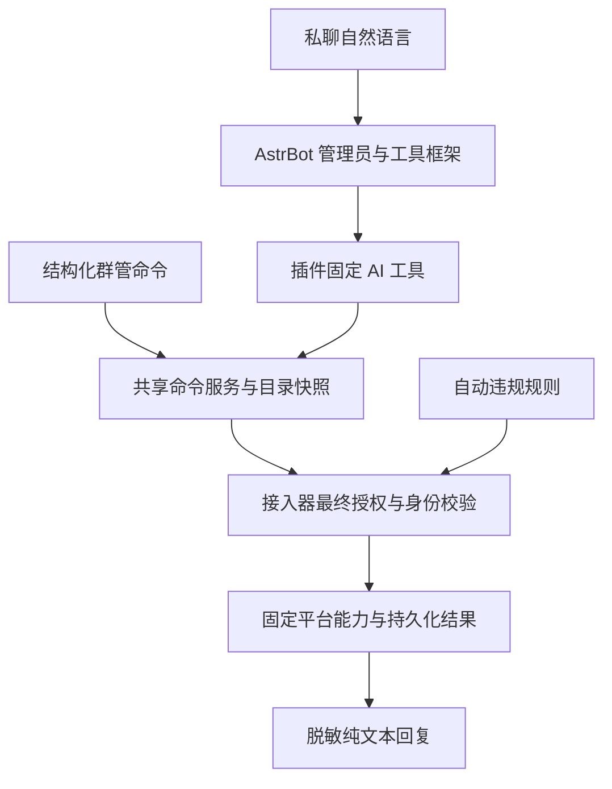

# 旺商聊群管与回复插件

更新：2026-10-03。[文档目录](../../../docs/wangshangliao.md)、
[接入器说明](../../../docs/zh/platform/wangshangliao.md)、
[当前测试与验收](../../../docs/zh/platform/wangshangliao-testing.md)。
日志统一进入 AstrBot 日志面板，详见[日志与排障](../../../docs/wangshangliao-diagnostics.md)。
数据分工、索引、备份回滚和性能验收见[数据库与性能维护](../../../docs/wangshangliao-database.md)。

## 私聊 AI 管理工具

人格若使用工具白名单，须显式勾选 `wsl_private_management`；仅注册插件不会覆盖人格工具配置。开发门禁的私聊 AI 测试采用事件级中间回复缓冲，非流式结果合并后发送，避免准备说明先消耗唯一结果回复。窗口关闭后新的工具调用拒绝执行。

启用支持工具调用的模型后，私聊管理员可使用自然语言查询目录、执行已有固定管理动作，
或预览规则、活动参数、创建抽奖及每日计划修改。`wsl_private_management` 仅接受固定动作及独立参数，
共用命令服务，不把模型输出当命令解析。普通用户与群聊不可使用。管理员身份、
动作授权和平台原生权限缺一不可。目录快照十分钟有效，重名先追问，未知结果不继续处罚。
不能修改管理员、动作授权或凭据，不提供任意消息撤回；配置请求本身不执行处罚。
实现与离线覆盖不等于全部真实模型对话验收通过，当前证据见测试文档。



AstrBot 内置插件，为原生旺商聊接入器提供管理命令、自动违规规则，以及 AI 纯文本回复与敏感信息过滤。无需额外安装 Rust 服务。

## 职责与数据流

```text
旺商聊消息
  → 原生接入器：登录、收发、身份映射、机器人互斥
  → AstrBot：会话、管理员身份、命令分发
      → 群管插件：参数校验、目录选择、违规规则
          → 接入器固定能力：动作授权、平台权限、幂等、回执
      → AI：人格、模型、知识库、上下文
          → 插件：纯文本要求、结果整理、回复脱敏
  → 接入器发送回复
```

插件不维护第二套管理员系统，不通过聊天授予权限。平台原生群角色、机器人动作授权和 AstrBot 管理员身份是不同的检查，不能相互替代。

### 架构表

管理页新增只读「架构表」和「权限表」。结构化条目位于
`dashboard/plugin-pages/wangshangliao/reference-tables.json`；测试核验实现文件存在、
固定命令无遗漏和无重复、公共群命令与执行服务一致。这些表不增加授权或执行入口。

| 模块 | 实现 | 职责与边界 |
| --- | --- | --- |
| 原生接入 | 接入器 `adapter.py`、`business.py`、`nim.py` | 认证、收发及 UID/NIM 映射；不按昵称猜身份 |
| 框架鉴权 | `waking_check/stage.py` | 当前会话有效配置 `admins_id`；群角色、@ 目标不授予身份 |
| 固定命令 | `syntax.py`、`commands.py` | 精确整条识别、公共命令分流、十分钟隔离目录快照；不调用模型 |
| 私聊 AI 工具与草案 | `main.py`、`intent.py`、`ai_config.py` | 仅管理员私聊；规则/活动参数及开抽预览确认、计划转二次确认；不设置权限 |
| 上下文审核 | `semantic.py`、`content_rules.py`、插件 `policy.py` | 独立模型审核同群上下文；故障规则兜底，正常和证据不足不罚 |
| 处罚执行与升级 | 接入器 `moderation.py`、`automatic.py` | 最终授权、原生角色、目标身份、幂等与回执；人工禁言不计自动次数 |
| 每日排名 | `rankings.py` | 已接收有效消息只读计数、分页、原生 @；不自动派奖 |
| 群抽奖 | `activities.py`、`activity_store.py` | 参数冻结、报名、随机开奖和一次结果发布；不自动付款 |
| 邀请归属与奖励 | `activities.py`、接入器 `adapter.py`、`nim.py` | 平台归属及去重积分；待审核、历史基线和归属未知不计奖 |
| 每日定时 | `schedules.py` | 预览确认、未来边界执行、创建者持续鉴权；暂停和删除不解禁 |
| 成员批量维护 | `cards.py` | 名片与封禁／注销清理独立任务；各自授权、保护管理角色、未知回读 |
| 回复与撤回 | 接入器 `event.py`、`reply_recall.py`、插件 `text.py` | 纯文本、脱敏、原生 @；对应群功能回复受理20秒后撤回，抽奖通知与报名反馈保留 |
| 插件管理页 | `dashboard.py`、页面 `App.vue` | 版本校验、逐群授权与有界审计；JWT + bot 权限，不直接处罚 |
| 持久化与门禁 | 接入器 `storage.py`、`test_window.py` | 按实例保存账本；测试窗口300秒／10条上限，不授予任何管理权限 |

### 权限表

「授权管理员」仅指当前会话有效 AstrBot 配置中的管理员 UID。
下表的「允许」表示入口允许，不代表平台一定执行成功；还需群启用、回复开关、
已保存的逐群动作白名单、原生群角色和目标身份校验。只读查询不提交处罚动作。
管理页显示的是**已保存**动作授权，不把未保存草稿或平台角色未知当作执行许可。

| 功能 | 普通群员·群内 | 授权管理员·群内 | 普通用户·私聊 | 授权管理员·私聊 | 额外条件 |
| --- | --- | --- | --- | --- | --- |
| 排名、抽奖状态 | 允许 | 允许 | 无权限 | 允许 | 群回复；私聊先选群 |
| 参加抽奖 | 允许 | 允许 | 无权限 | 转活动群报名 | 活动开放、资格及去重校验 |
| 我的邀请、邀请奖励 | 允许 | 允许 | 无权限 | 允许 | 只查本人积分，不付款 |
| 帮助、我的权限、sid | 静默 | 静默 | 无权限 | 允许 | 仅私聊，不公开管理员查询数据 |
| 群列表、选群、成员目录、下一页 | 静默 | 静默 | 无权限 | 允许 | 当前操作者私聊快照，十分钟有效 |
| 能力、规则、违规计数、结果、开发门禁 | 静默 | 静默 | 无权限 | 允许 | 只读；门禁命令不打开窗口 |
| 禁言 | 无权限 | 允许 | 无权限 | 允许 | `mute`；群内真实 @、私聊编号；默认30分钟，无二次确认 |
| 解禁 | 无权限 | 允许 | 无权限 | 允许 | `unmute`；唯一目标，无二次确认 |
| 踢出、确认踢出 | 无权限 | 按规则模式 | 无权限 | 允许 | `kick`；业务规则模式必须私聊预览和新消息确认，旧模式保留固定动作 |
| 公告 | 无权限 | 允许 | 无权限 | 允许 | `announce` 与原生群管理角色 |
| 全员禁言、解除全员禁言 | 无权限 | 允许 | 无权限 | 允许 | 分别需 `mute_all`／`unmute_all`；先暂停定时 |
| 抽奖设置、中奖名单、抽奖记录 | 静默 | 静默 | 无权限 | 允许 | 当前选群的设置及历史 |
| 奖品、人数、倒计时、上限、邀请门槛、联系人 | 静默 | 静默 | 无权限 | 允许 | 下期参数；已开活动不可改 |
| 开启抽奖、立即开奖、取消抽奖 | 静默 | 静默 | 无权限 | 允许 | 群主动发送与回复授权；不自动付款 |
| 邀请奖励设置、开启、暂停、状态、记录 | 静默 | 静默 | 无权限 | 允许 | 统一积分；启用建立基线，待审核不计奖 |
| 定时预览、确认、状态、暂停、恢复、删除 | 静默 | 静默 | 无权限 | 允许 | 创建／恢复需两个全员动作授权和确认；运行持续检查创建者 |
| 自然语言管理 | 无工具 | 无工具 | 无权限 | AI 工具 | 模型／人格启用工具；所需动作各自授权 |
| 成员名片维护 | 无入口 | 无入口 | 无权限 | AI 工具或机器人页 | `rename`；单人自定义或批量规范先预览再确认；自动扫描按群另行开启 |
| 封禁／注销账号清理 | 无入口 | 无入口 | 无入口 | 无聊天入口 | 仅机器人页；`cleanup` 不继承 `kick` 或 `rename` |

Dashboard 登录权限与聊天管理员分开：插件页须 JWT 和 `bot` 范围，聊天管理员不能
据此绕过面板认证。主动发送只授权目的地，不授予群员管理员身份。自动内容审核不要求
被审成员是管理员；定时及活动任务持续核验创建者，测试窗口不能替代上述任何授权。
当前接收机器人启用 `manual_kick_only`，AI及自动规则不踢人。其他未启用此限制的兼容实例，自动踢出另需逐群开关及 `mute`、`kick`、`recall`，三次自动禁言受理后，第四次确认违规才升级。
功能回复撤回只操作机器人自己的对应消息，不因此授予撤回成员消息的权限。

## 配置入口

### 管理员私聊名片控制

已支持自然语言开关目标群的自动名片规范，以及指定普通成员改为自定义群名片。
只改群名片，不改账号昵称；群主、平台管理员、已接入机器人和不可用账号继续受保护。
例如“帮我关闭大海兼职群的自动规范名片”，AI通过
`config_preview` 的 `target=moderation`、`changes={"card_auto":false}`
显示本群开关前后值，管理员在同一私聊发送原样 `确认设置 <码>` 才保存。
开启需要已有 `rename` 授权；关闭不恢复历史名片，不会修改其他群开关或授予权限。

例如“把大海兼职群里张三的群名片改成值班小张”：先选群、查询成员、重名澄清，
AI用当前页编号调用 `card_member_preview`，不能凭昵称猜UID。返回原名、新名、
目标群和预览ID，收到另一条明确“确认修改名片”后才通过 `card_execute` 排队。
执行前重新核验成员映射、原名、当前管理员和平台权限；任务运行中撤权也停止。
预览十分钟有效，不可跨账号、管理员或私聊确认；未知结果先查 `card_status`，不盲重试。
后台接受请求不等于改名成功，须回读确认。管理页“对话示例 → 私聊与权限 → 名片设置”
提供静态示例，不会发送消息或改配置。审核模型、关键词等仍为实例级，本次未改成逐群配置。

当前接收机器人已启用「仅手动确认踢出」限制 `manual_kick_only`，关闭全部自动踢出。
AI踢出请求、AI重新开启自动踢出、旧自动踢出意图均被拒绝；管理员手动私聊预览并
另发确认仍可执行。该限制不能由AI配置工具修改。后续自动违规处理保持撤回＋最多60分钟禁言。

审核配置提供「递进禁言＋撤回（5分钟 / 15分钟 / 1小时）」开关。
开启后首次确认违规即撤回并禁言，后续按本轮受理次数升级，不再先警告。
当前接收机器人第三次及后续只禁言最多60分钟，不踢出。只有未启用 `manual_kick_only`
的兼容实例，才可能在第四次确认违规时撤回并踢出；还需逐群自动踢出开启且授权完整，
不会在禁言到期时自动踢出。关闭踢出时后续禁言维持60分钟。
撤回与禁言回执分别记录，失败不冒充成功，未知结果不重试处罚。
关键词在AI审核中作为规则数据，关闭AI或模型失败才走字面规则兜底；
当前限制下，递进模式的踢出关键词只参与违规判断，不触发踢人；兼容自动踢出分支也不能跳级。详情见[审核规则](../../../docs/wangshangliao-content-rules.md)。

新增「插件 → 旺商聊群管 → 旺商聊管理」页面，集中编辑 AI 审核、规则兜底、回复设置及当前群授权，并查看自动禁言累计与有界近期审计。机器人配置入口继续保留；登录、启用群、主动发送和成员批量任务仍在机器人页面。页面使用 AstrBot 插件消息桥和已有配置保存服务，不返回登录凭证、不提供直接处罚或重试按钮，不修改处罚计数。切群与刷新会提醒未保存修改，保存带配置版本校验。

页面源码位于 `dashboard/plugin-pages/wangshangliao`，运行 `npm run build:wangshangliao-page` 生成内置插件 `pages/management` 静态资源，完整 Dashboard 构建会同时执行。已安装插件列表自动发现页面，无需单独导航配置。API 同时核验插件存活状态与 Dashboard 机器人权限；插件卸载后保留路由的调用拒绝。

管理页九个视图包括审核配置、群授权、活动控制、定时管理、处罚记录、群内命令、
对话示例、架构表、权限表。对话示例仅演示，不发消息或保存；参考表只读。
活动控制保存下期参数/邀请积分，启停与开奖仍在管理员私聊；定时管理仅看/暂停。

### 管理页 API

前缀 `/api/v1/plugins/extensions/wangshangliao_moderation/`，
必须插件存活、Dashboard JWT 与 `bot` 范围；独立插件/API Key 凭据不能代替。
不要把聊天管理员 UID 当后台认证，也不要在文档展示 JWT。

| 路径 | 方法 | 参数及边界 |
| --- | --- | --- |
| `settings` | GET | 实例公开配置、运行状态、提供商ID/模型名、`revision`；不返回登录凭据 |
| `settings` | POST | `bot_id`、`revision`、`group_id`、可编辑 `policy`/`group`、`reply_private`、`admin_provider_id`；只补丁当前群及编辑的实例字段 |
| `audit` | GET | `bot_id`、`group_id`；自动次数、近期动作、语义/规则有界记录，不修改计数 |
| `invitations` | GET | `bot_id`、`group_id`、可选 `member_id`；`source=members/records`，记录另支持 `pending_only`、`last_id` |
| `activities` | GET | `bot_id`、`group_id`；下期设置、邀请状态、近期活动与独立活动 `revision` |
| `activities` | POST | `bot_id`、`group_id`、活动 `revision`、完整六字段 `lottery`、`invite_rate`；不启停，不付款 |
| `schedule` | GET | `bot_id`、`group_id`；计划、近期执行与变更记录，未创建返回空计划 |
| `schedule` | POST | `bot_id`、`group_id`、当前整数 `version`、`action="pause"`；不解禁，不创建或恢复 |

`group` 可编辑字段为 `permissions`、`auto_kick`、`card_auto`、`reply`、
`customer_provider_id`，客服模型实际保存为群ID到模型ID字符串映射。
设置、活动与定时版本不能互用。400无效参数、403认证/权限不足、404实例不存在、
409版本或活动冻结冲突、503离线；先刷新核对，不能强制覆盖或借重试提交处罚。

生产页面将 Vue、样式和官方插件消息桥打包进同一 HTML，使用经典脚本；不从隔离 iframe 的 opaque origin 再请求需登录的模块或样式，兼容 Cloudflare Access 等认证代理。iframe 的 sandbox 权限保持不变，不启用 `allow-same-origin`。可用 `scripts/check_wangshangliao_page.py --access-cookie-guard --browser <Chromium 路径>` 重现登录 Cookie 门禁并检查页面；交互保存使用模拟响应，不修改生产配置。

1. 在「消息平台／创建或编辑机器人」完成登录、保存连接，选择启用的群。
2. 按需要开启私聊回复、各群回复和群管动作授权。普通群 AI 回复仍须明确 @ 当前机器人。
3. 首次管理员从有效配置 `admins_id` 的已有私聊列表按名字选择并保存，授权依据仍是 UID。
   非管理员私聊 `sid` 也被拒绝，不能依赖该命令自助获取首次管理权限。
4. 自动违规规则在机器人配置中设置；未配置的动作不自动获得权限。

连接在线不代表授权已配置，也不代表每项平台动作都能执行。

## 三路 AI 与自然语言配置

| 路由 | 模型范围 | 人格和知识库 | 旺商聊管理工具 |
| --- | --- | --- | --- |
| 群内 @ 客服（含管理员） | 逐群 `ai_routes.groups[业务群ID]` 模型ID字符串 | 原群会话 | 不提供 |
| 普通私聊客服 | 当前私聊会话模型 | 原私聊配置 | 不提供 |
| 管理员私聊群管 | 实例 `ai_routes.admin_provider_id` | 原私聊配置 | 鉴权后提供 |
| 群内容审核 | 实例 `moderation.semantic.provider_id` | 独立提示，不继承人格/知识库 | `tools=None` |

插件页选择三个模型，空选择沿用对应会话模型，并显示来源。不可用配置不应被当作
正常管理完成；工具白名单仍需允许 `wsl_private_management`。客服隔离针对本工具，
不意味着清空人格中所有其他工具。固定命令优先识别，不经过模型。

管理员示例（每次单独发送；以下为交互格式，不是真实执行记录）：

```text
管理员：把大海兼职群下期抽奖改为18元猪脚饭，3个名额，10分钟，最多15人，联系人秦铭。
机器人：预览目标群、修改前后参数；在本私聊发送：确认设置 <确认码>
管理员：确认设置 <确认码>
机器人：保存结果。仅修改下期参数，没有开启抽奖。
管理员：开启抽奖
机器人：群通知受理后开放报名，并返回本期信息。
```

也可直接说“在大海兼职群创建并开启抽奖，奖品……，中奖人数……，倒计时……
分钟，参与上限……，邀请门槛……，联系人……”。AI 使用 `lottery_start` 草案，
明确展示确认后会开启活动并通知群，再等待独立的 `确认设置 <确认码>`。
确认前不会写入活动；确认时复核管理员、群授权、配置版本和当前活动状态。
只有活动账本为 `open` 才返回 `started`；通知未知返回 `not_confirmed`，不能盲目重试。
立即开奖、取消和邀请奖励启停仍使用既有固定命令；自动到时开奖继续有效。

`确认设置` 经模型调用 `config_confirm`，不是 `syntax.py` 固定命令；因此需要模型和
工具仍可用。失败时重新预览，或使用固定设置命令，不猜码、不连续重试。
例外是已撤权用户的精确确认请求：程序直接返回“无权限”并丢弃旧草案，不再调用模型；
群内精确确认静默处理。客服请求发现旧管理工具历史时，新建客服会话并保留原管理员会话，
不沿用先前管理员能力承诺。开抽预览和开启结果以程序校验结果展示，不依赖模型改写。
草案600秒有效、一次使用，按实例、登录账号、管理员 UID、私聊 UMO 隔离；
同一操作者新预览替换旧草案，重启丢弃。确认前复核权限与完整机器人配置版本，
活动参数还核对活动版本及群锁；他人、跨私聊、过期、重复或旧版本确认不写入。

| 配置区 | 允许修改 | 真实影响范围与限制 |
| --- | --- | --- |
| `moderation` | `enabled`、`automation_enabled`、`recall_enabled`、`progressive_mute`、`cooldown_seconds`、`mute_keywords`、`kick_keywords`、`semantic`、`auto_kick`、`card_auto` | `auto_kick` 和 `card_auto` 仅改目标群；其他为实例级，可能影响其他已启用群。开启自动名片需已有 `rename` 授权；`manual_kick_only` 下不能开启自动踢出 |
| `semantic` | `enabled`、`provider_id`、`timeout_seconds`、`context_limit` | 模型须已配置，复用策略校验；不允许任意提示/工具 |
| `activities` | `lottery` 参数及 `invite_rate` | 当前群下期设置，不开启/开奖/取消；活动开放期间抽奖参数冻结 |
| `lottery_start` | `lottery` 参数 | 确认后保存参数并发送群通知；通知受理才开放报名；不改邀请奖励，不绕过主动发送授权 |
| `schedule` | `start`、`end` | `HH:MM`，不相等；确认设置后仅生成定时预览，另发 `确认定时 <新码>` 才保存 |

禁止字段包括管理员身份、权限授权、账号凭据、主动发送目的地及其他未知字段。
`manual_kick_only` 是受保护字段，不能由 AI 改写。当前接收机器人只自动撤回和递进禁言；
保留的自动踢出兼容分支也不能自然语言改成任意次数。`card_auto` 关闭不恢复旧名片，
开启不等于为目标群授予改名权限。
计划的双阶段确认与直接固定命令流程见[每日计划](../../../docs/wangshangliao-schedules.md)。

## 完整命令索引

每条必须是单行完整命令；不解析一条消息中的多项操作。旧斜杠/群管写法为兼容别名。
群内公共命令不要求管理员；全部私聊固定命令只向有效管理员开放。
群内私聊专用固定命令静默消费，不发“请转私聊”提示、不执行、不落入 AI；
旧斜杠/帮助入口同样静默。群内 @ 不提供管理配置工具。

| 分类 | 固定命令与参数 |
| --- | --- |
| 帮助/身份 | `帮助`（`群管帮助`、`help`）、`我的权限`（`sid`） |
| 目录 | `群列表`、`选择群 <编号>`、`成员列表`、`成员搜索 <名称>`、`下一页` |
| 状态 | `能力`、`规则`、`违规计数`、`结果 <操作ID>`、`开发门禁` |
| 单人管理 | `禁言 <真实@或私聊编号> [分钟]`、`解禁 <目标>`、`踢出 <目标>`、`确认踢出 <码>` |
| 群管理 | `公告 <内容>`、`全员禁言`、`解除全员禁言` |
| 排名 | `排名 [页码]`；别名 `今日排名`、`排行`、`今日排行` |
| 群员活动 | `参加抽奖`、`抽奖状态`、`我的邀请`、`邀请奖励` |
| 抽奖设置 | `抽奖设置`、`抽奖奖励 <文本>`、`中奖人数 <数值>`、`抽奖倒计时 <分钟>`、`参与上限 <数值>`、`抽奖邀请门槛 <数值>`、`领奖联系人 <文本>` |
| 抽奖控制 | `开启抽奖`、`立即开奖`、`取消抽奖`、`中奖名单 [期数]`、`抽奖记录` |
| 邀请设置/控制 | `设置邀请奖励 <数值>`、`开启邀请奖励`、`暂停邀请奖励`、`邀请奖励状态`、`邀请记录` |
| 定时 | `定时禁言 <HH:MM> <HH:MM>`、`确认定时 <码>`、`定时状态`、`暂停定时`、`恢复定时`、`删除定时` |

自然语言的 `确认设置 <码>` 不是上表固定解析器入口。名片任务为 AI 工具/后台入口，
封禁注销清理只在后台；不存在聊天 `/link` 专属邀请链接或任意成员消息撤回命令。

### 数值范围

| 设置 | 默认值 | 范围与单位 |
| --- | --- | --- |
| 手动聊天禁言 | 30 | 整数1至1440分钟；内部自动/维护禁言沿用1分钟 |
| 中奖人数 | 3 | 整数1至100；有限容量时不能大于容量 |
| 抽奖倒计时 | 10 | 整数1至10080分钟 |
| 参与上限 | 15 | 整数0至10000；0不限 |
| 邀请门槛 | 0 | 整数0至10000人；本群有效已记账人数 |
| 每人邀请奖励 | 0 | 0至999999.99，最多两位小数，积分而非自动现金转账 |

奖品/联系人须非空单行文本、符合128字符清理和512字节上限。
示例“每拉3人才能报名”
对应邀请门槛3，不等于每3人自动报名；群员仍需发送 `参加抽奖`。
15名有效参与者、3人中奖才是20.00%；到期实际人数不足时按真实人数计算，
不伪造固定中奖率，不因满员提前开奖。

## 邀请归属只读查询

新增插件 API `GET /api/v1/plugins/extensions/wangshangliao_moderation/invitations`，
仅允许管理面板 JWT 的机器人权限，参数为 `bot_id`、已启用群的业务 `group_id`，
以及可选的精确业务 `member_id`。使用现有在线连接调用 NIM `getTeamMemberInvitorAccid`
查询，并通过完整成员名单转换邀请者身份，不按昵称、显示群号或聊天正文猜测。

```sh
.venv/bin/python scripts/check_wangshangliao_invitations.py --bot BOT_ID --group BUSINESS_GROUP_ID
```

每次最多查询200名当前成员，同群查询间隔30秒。`attributed` 表示平台返回邀请者且能够核对其
当前成员身份；`inviter_not_in_roster` 保留平台返回的 NIM 邀请者账号，但不猜测业务账号；
`unattributed` 表示平台未提供归属。这是当前名单快照，不是实时入群事件、历史拉人账本、
审核结果或活动有效次数，也不认定历史成员属于本期新人。待审核或未在名单中的账号不能
报告为成功入群。接口不批准申请、不发送邀请、不发消息、不处罚、不修改配置或账本。

### 待审核邀请与历史记录

同一接口增加 `source=records`，通过当前机器人业务会话读取
`/v1/group/get-apply-logs`。首读参数必须为 `{}`；续读可用平台返回的
`{"lastId":"..."}`。该业务接口不接受 `groupId`、`v` 或分页参数，返回的账号可见日志
必须在服务端过滤为已启用的目标群，再输出白名单字段，不能原样暴露其他群的记录。

```sh
# Only account-visible pending invitations in this enabled group.
.venv/bin/python scripts/check_wangshangliao_invitations.py --bot BOT_ID --group BUSINESS_GROUP_ID --records
# Include historical and unknown-state invitations; still not successful-join credits.
.venv/bin/python scripts/check_wangshangliao_invitations.py --bot BOT_ID --group BUSINESS_GROUP_ID --records --all-states
```

`member_id` 来自日志的 `applicant.userId`，`inviter_id` 来自 `inviter.userId`，
不要求双方仍在群里。显示账号和 NIM 账号分别保留在 `*_account_id`、`*_nim_id`，
不能互相替代。`apply_id`、`apply_time`、原始 `state` 用于区分重复邀请和历史记录。
`MEMBER_STATE_INVITED`、`MEMBER_STATE_APPLIED` 标为待审核；已正常处理或管理员拒绝
标为非待审核，未知状态的 `pending` 为 `null`，不会猜测。默认仅返回待审核邀请，
`pending_only=false` 才包含其他状态，`last_id` 必须使用平台返回的游标，不能填申请
`apply_id`。`apply_time` 保留平台的原始时间与时区，例如以 `Z` 结尾的时间是 UTC；
不要把历史邀请当作今天截图中的新邀请。

结果的 `scope=account_visible_records`、`complete=false` 明确表示仅覆盖当前账号可见
记录。空列表不证明全群没有待审核邀请，正常状态也不证明用户现在仍在群里。查询不自动
审核、不标记通知已读、不删除日志、不计数、不抽奖，同群日志读取间隔30秒，单次最多
输出200条匹配邀请，超限或无效响应报错而不静默丢弃。

## 无前缀命令

直接发送整条命令，不需要 `/`、`群管` 前缀或 @ 机器人。旧写法仍兼容，但所有帮助和
操作提示使用新写法。固定命令不经过聊天模型；普通句子、引述、否定和多行组合不是命令。
身份始终来自有效 AstrBot 配置的管理员 ID，不能通过昵称、群主身份或聊天文字自授权。
普通 AI 群聊仍需 @ 机器人，裸命令仅开放固定白名单，不改变其他平台的命令语法。

普通群员在当前已启用且允许回复的群发送 `排名` 或 `今日排名`，查看北京时间当天排行，
每页20条，`排名 2` 查看第二页，`排行`、`今日排行` 是别名。只返回标题、页码、编号、
榜单成员的原生 @ 和条数，不 @ 查询者，不附日期、个人名次或统计说明；身份映射缺失
只显示名字，不伪造 @。空页显示「暂无记录」。管理员私聊先选择群后也可查，使用纯文字。
榜单只读取本实例已有的认证文字记录，
不声称覆盖离线缺失历史；不计机器人、命令、纯表情、已确认违规或无法核实时刻的消息。
每人30秒最多计一次，相同标准化内容五分钟不重复计数；按计数、达到该计数的时间和稳定
UID 排序，缓存十秒。发言排行不自动派奖；抽奖和邀请奖励须单独私聊开启。

群内管理直接发送 `禁言 @成员`、`解禁 @成员`、`公告 内容`、`全员禁言`、
`解除全员禁言`。操作者须通过管理员 ID 校验，目标 @ 须与传输身份对应，不接受文本伪造
或附带疑问、说明的目标命令。部署中的手动踢出仍必须私聊预览并二次确认。

禁言默认30分钟；`禁言 @成员 3` 或 `禁言@成员 3` 指定3分钟，支持1至1440的
整数分钟。私聊编号也支持 `禁言 2 3`。禁言和解禁不需要二次确认，平台受理后简洁
回复，不追加“尚未确认”；未知请求仍不重复提交。自动违规和维护禁言的默认时长不变。
群内回复开关须开启，普通成员才可收到排名；管理动作始终仅允许有效配置的管理员 UID，
不能通过 @ 管理员获得权限。机器人主动发送目标授权不替代管理员名单。
普通群员的管理命令拒绝执行。群／私聊回复关闭时不静默执行裸命令，自动违规处罚不受影响。

群内排名、管理命令结果、无权限回复、自动违规警告，在各段消息被平台受理
20秒后自动撤回。只撤回机器人自己的对应消息，不删除成员命令、私聊消息、
普通 AI 聊天回复或主动发送内容。使用发送回执中的真实路由，不增加撤回成员消息的
群管授权。待执行任务持久保存，重启或短暂断线后恢复；超过到期时间五分钟的旧任务
不再补撤回。超时、失败和中断结果保留审计，不盲目重试。

## 私聊命令

### AI 能力介绍与设置引导

管理员私聊询问“你能做什么”“我不会设置”时，按当前工具是否可用分别引导，
不把咨询或例句当作执行指令。可用时简要介绍抽奖/邀请数值、审核规则、定时规则；
目标群与缺失参数逐步核对，配置仍需真实预览与确认。工具未开放时说明暂不能直接代办，
可引导现有固定命令，不谎称管理员无权限。当前工具未覆盖的活动操作仍使用固定命令。

普通用户私聊及所有群内客服只介绍公开业务、群内排名、抽奖报名及本人邀请查询。
不披露管理员名单、管理命令目录、后台地址、工具名称、账号凭据或其他人的私聊与奖励明细。
公开联系人与公开业务链接可按需提供，手机号与邮箱仍掩码。介绍入口不代表功能已开启，
也不表示查询或报名已完成。提示按已验证的会话角色注入，不靠用户自述判断。
输出脱敏保留原有凭据与联系方式过滤；不能保证识别任意无标签、编码或拆分的秘密。

### 群抽奖

管理员私聊先发送 `群列表`，按群名确认后发送 `选择群 1`。列表编号仅对当前操作者有效，
十分钟后过期；同名群附群号区分。之后每条命令单独发送：

```text
抽奖奖励 18元猪脚饭
中奖人数 3
抽奖倒计时 10
参与上限 15
抽奖邀请门槛 0
领奖联系人 秦铭
开启抽奖
```

倒计时按分钟；参与上限 `0` 表示不限；邀请门槛按本群已记账的有效邀请人数计算。
开启时冻结本期参数，并要求该群已有主动发送授权。群员发送 `参加抽奖` 报名，
同一成员只记一次，到期随机抽取仍在群内且身份核验通过的成员。统一公布真实 @ 中奖
名单、奖品和领奖联系人；15人参与、3人中奖显示20.00%。报名未满不提前开奖。
管理员可发送 `立即开奖`、`取消抽奖`、`抽奖状态`、`中奖名单`、`抽奖记录`；
`中奖名单 1` 查看指定期数。群员可查询 `抽奖状态`。抽奖开始、取消、中奖名单通知及
报名和状态回复均保留，不自动撤回。奖品由联系人发放，不自动付款。
报名时间使用原生消息外层的服务端时间；手机端内层时间缺失或为0不会被误判过期。
仍拒绝活动开始前、截止后、未来异常时间或延迟超过五分钟的报名消息，不以接收时间
替代消息发送时间，也不把开奖倒计时限制为五分钟。
截止后若后台尚未完成开奖，状态显示「报名已截止，等待开奖」，不再显示报名中。
报名成功才使用庆祝标记；重复报名显示已有记录，过期、名额满和身份未核验显示警示。

### 邀请奖励

```text
设置邀请奖励 5
开启邀请奖励
邀请奖励状态
邀请记录
暂停邀请奖励
```

同群统一每人奖励积分，最多两位小数。启用时现有成员建立基线，不补历史奖励。
每35秒左右检查，只有后续新成员已入群、平台明确返回邀请归属、双方仍在群内且状态
正常、身份稳定才记一笔奖励。待审核、归属不明、机器人、重复进群不计奖。
归属待核验最多保留24小时，不能核验则不计奖；没有完整入群事件的离线缺口不估算。
修改奖励值不重算旧账；暂停再开启时重新建立基线，不补暂停期间的邀请。
群员发送 `我的邀请`、`邀请奖励` 查看自己的有效人数和积分。只记账，不自动支付现金。
奖励由后台周期核验后记账，不会逐笔主动群发到账提醒；管理员可用 `邀请奖励状态` 查看扫描状态。

非管理员私聊命令只返回“无权限”；普通咨询仍受私聊回复开关、人格和模型配置控制。

下列查询和操作需要 AstrBot 管理员：

```text
群列表
选择群 1
成员列表
成员搜索 小明
禁言 2
解禁 2
踢出 2
公告 公告内容
全员禁言
解除全员禁言
能力
规则
违规计数
结果 <操作ID>
开发门禁
```

成员列表包含名字和业务 ID。编号来自当前目录快照，按机器人、操作人及私聊会话隔离，十分钟过期；重新列出或搜索后使用新的编号。聊天不能修改授权。

## 群内命令

群内开放普通成员的排名/活动查询和管理员固定管理动作。私聊专用查询静默，
不展示目录、权限或规则。本部署业务规则模式的管理员群内踢出同样静默，仍须私聊预览确认：

```text
排名
禁言 @成员
解禁 @成员
公告 公告内容
全员禁言
解除全员禁言
```

通过客户端选择器真实 @。成员操作必须唯一识别一个目标；映射不明时拒绝，不按昵称匹配。命令不进入 AI，也不因命令正文包含违规关键词触发自动处罚。

## 自动违规处理

2026-10-03：当前接收机器人启用 `manual_kick_only`，AI和自动规则不再踢人。递进模式确认违规后撤回并依次禁言5、15、60分钟，后续上限60分钟；人工踢出仍需私聊固定命令和独立确认。自动次数按账号、群、成员持久保存，失败、未知和重复操作不计数，未知状态停止该成员后续自动处罚。历史人工操作不补算。其他明确授权的兼容实例才保留第四次违规自动踢出分支。

`semantic.py` 通过 AstrBot 模型接口读取当前消息与同群近期上下文，不调用工具或聊天人格。明确正常或有歧义不处罚；模型故障及无效证据交由高置信规则兜底。`automatic.py` 持久化自动禁言及踢出意图，接入器最终检查三次真实回执、新违规消息、身份、逐群授权和平台角色。详情见新版从零开始教程。

仅未开启递进模式的旧关键词路径使用独立禁言/踢出关键词；同时命中以禁言为优先，`manual_kick_only` 下不执行踢出词规则。该旧路径首次违规在开启撤回时尝试撤回并 @ 警告，第二次执行相应处罚，计数窗口为24小时；不能用它描述当前递进模式。冷却、身份核验、动作授权与幂等限制按各自路径生效。任意手动撤回命令未提供，撤回通过自动违规入口处理。
关键词模式同样拒绝时间未知、超前超过五秒或延迟超过五分钟的消息，不计违规次数、
不发警告、不撤回或处罚。完整成员目录返回后再次检查动作授权与自动化开关。
固定命令、私聊及群内唤醒对话也不重放此类历史消息，不进入管理工具或客服 AI。
这些判断基于上游消息时间，不以重连后的本地接收时间代替。

操作状态应区分「服务端已接受」「已确认」「拒绝」「未知」。已接受不等于对端确认；未知结果不自动补发，不能反复提交处罚来试探。

## 纯文本与回复脱敏

旺商聊不支持富文本。帮助和查询使用【标题】、空行、编号；插件追加 AI 排版要求，不替换人格。普通 AI 结果中的 Markdown 转为文本，链接和代码保留原意，结构化 @ 不被改写，并关闭该结果的文字转图片。

回复过滤覆盖本插件命令结果和普通 AI 结果：

- 明确标注的 password、密码、验证码、API Key、Token、secret 等字段值。
- 常见 `sk-` 密钥、Bearer 凭证、JWT 和完整私钥块。
- 中国大陆 11 位手机号及常见邮箱，使用掩码展示。
- 业务 ID、群 ID、操作 ID 不进行无差别数字替换。

凭证过滤优先于代码及链接完整性，因此含认证参数的链接或示例代码会被遮盖。此功能是有限规则过滤，不是完整 DLP：无标签的任意密码、拆分或编码后的秘密可能无法识别；手机号形状的其他数字可能误判。第三方插件直接发送、主动发送、附件和流式路径不在本插件普通 AI 结果钩子的覆盖承诺内。

这不是入站脱敏：不阻止原始消息进入模型，不修改历史记录，也不清理框架日志。不要把回复过滤视为凭证存储或日志治理方案。

接入器文本边界同时去除成对的 `think`、`thinking`、`thought`、`analysis` 标签块、
开头未闭合标签及孤立结束标签，避免部分模型推理混入可见正文。
不承诺识别无标签推理、所有流式输出或任意嵌套格式；历史和日志不回溯清理，
过滤后为空也不等于客服成功回答。框架结构化 reasoning 的展示仍应核对框架设置。

## 开发测试门禁

已接入的机器人默认相互排斥，即使是管理员也不例外。Dashboard 保存测试范围不会开启窗口，须单独开启。窗口仅存内存，最长五分钟、最多十次入站，重启、退出或替换账号后失效；一次仅支持一个指定发送实例。

- 私聊 AI、私聊命令、群内命令、群内违规规则为独立范围；在接收机器人配置来源发送实例。
- 群规则还需专用 `WSL_TEST_` 关键词及指定群。
- `private_ai` 范围用于单向普通私聊 AI 测试。它不放行斜杠命令，不绕过私聊回复开关，每条仅允许一次关联回复。
- `group_ai` 范围仅放行指定来源、指定群中真实结构化 @ 本机器人的非命令消息；
  不接受文本假 @，不绕过群回复开关或管理员工具隔离，每条仍仅一次关联回复。
- 反向继续互斥，避免结果触发机器人循环。
- 门禁不授予管理员身份、平台角色或机器人动作权限。

测试结束关闭窗口，恢复临时主动发送及其他测试配置。普通账号验收与受控机器人测试应分别记录。

## 常见问题

**帮助没有回复**：检查接收实例在线、允许私聊回复、插件启用状态。发送者若也是已接入机器人，检查门禁是否到期或因重启关闭；`ignored_bot` 表示互斥拦截，不代表管理员设置丢失。

**`private_peer_unknown`**：主动发送目标尚未成为本地已知会话；先用真实客户端建立私聊，不伪造消息记录。

**AI 回复慢**：区分模型生成、知识库查询、工具调用与平台发送。普通客服测试曾出现工具调用和超时，不应仅以连接在线认定稳定。

**排行换行或 @ 前空格丢失**：2026-10-02 全量离线回归发现3项输出格式失败，
涉及结构化消息 Plain 分段边界；文档中的榜单格式是预期契约，不是缺陷已修复的证明。
详情和测试名见当前验收文档，本次文档更新未改消息处理代码。

## 验证与边界

已有受控实测覆盖帮助入口、管理员查询、普通身份越权拒绝、普通私聊 AI 回复及两轮上下文。关闭私聊回复的线上测试已通过模型入口计数确认零调用；开启回复的对照组计数为一次。处理中撤销授权后未继续发出回复，群管执行也在变更前中止。群内未 @ 的线上零调用仍待独立验收。复杂排版的手机显示、任意秘密识别、完整普通外部账号验收及长期稳定性仍不能宣称全部通过。

```sh
.venv/bin/python -m pytest -q tests/test_wangshangliao_*.py
```

上述为离线回归，不发送真实消息。真实副作用脚本及四场景验收标准见当前测试文档；
群内 @ AI 和管理员自然语言改配置不能仅凭固定命令通过就标为已验收。

日志和标题由 AstrBot 核心负责：标题在列表、详情、搜索及导出保持一致。启用文件日志后可从当前文件恢复有限历史，每类最多读取末尾 4 MiB／1000 条，合并上限 2000 条；不加载更早轮转文件。已验证浏览器断网补发、服务重启恢复及 390 px 追踪页面换行。

成员分页使用 `下一页`，编号仅绑定当前页。警告发送状态独立于违规次数：明确失败先补警告，未知不重发且不进入处罚。操作结果通过接入器固定查询接口读取。开发测试只使用实例级门禁，旧环境变量不再生效。

Platform scope: moderation commands are filtered to the `wangshangliao` adapter. The plugin declares `support_platforms: [wangshangliao]`, so Telegram command registration excludes its commands. Existing runtime checks restrict moderation actions and presentation changes to Wangshangliao; the LLM hook also removes its management tool from unauthorized requests.

## 群名片任务

封禁（`ACCOUNT_STATE_BAN`）和注销（`ACCOUNT_STATUS_CANCELLED`）账号在预览及发送前排除。历史未知操作只做回读：若目标已封禁或注销，保留未知结果并隔离该目标，新任务可继续处理其他成员；隔离目标不会自动重试。普通账号的其他未知结果仍会暂停整个任务。

历史验收（2026-09-20）：指定测试群内普通成员 `D1 → 名片测试 → D1` 完成两次平台目录回读确认，临时授权已恢复。该记录不代表后续版本的自动进群、整批规范或手机对端已全部验收。当前 Dashboard 单成员预览支持配对的 `card_member`、`card_name`；管理员私聊 AI 使用 `card_member_preview`，参数为当前成员快照的 `member_number` 与 `card_name`，不得直接猜测账号 ID。

插件 `cards.py` 负责两字命名、持久化预览、任务与五分钟目录扫描；接入器 `rename_member()` 负责固定协议、最终授权、身份与原名校验以及回读。扫描不使用模型。

在消息平台逐群勾选名片动作授权并保存。自动开关另行开启，默认关闭。手动任务从 Dashboard 预览后执行，支持进度与停止。私聊管理员工具支持 `card_preview/card_member_preview/card_execute/card_status/card_stop`，需要人格工具白名单启用 `wsl_private_management`。生成预览与明确执行必须是两条用户消息；执行时重新检查当前管理员身份、群授权和成员快照。

优先群名片，空白时用昵称；按 Unicode 字素取前两字符，不拆 Emoji；不足两字符生成并保存“大海群员＋六位数字”。排除已接入机器人、自己、群主与管理员。人工更改过的原名不覆盖。未知结果不重发，重启先回读。成员目录不完整或身份不一致时不执行。

语义执行门禁使用当前真实消息，不使用模型声称的授权；否定、查询、条件、引用需先澄清。规则门禁测试不等于真实模型自然语言验收，平台回读也不等于手机对端确认。

### 封禁／注销账号清理

Dashboard 的“成员批量操作”提供独立清理预览、确认、执行、进度及停止。需逐群授予 `cleanup`，不会继承 `kick` 或 `rename` 授权；默认不自动运行。只移出平台明确封禁／注销的普通成员，不删除账号，不按昵称推断。机器人及群管理角色保持保护。执行前重新校验，结果未知暂停回读，重启不续跑；清理记录与名片处理标记隔离。

引用回复兼容：AstrBot 的“引用回复”装饰在旺商聊降级为普通文本回复，群聊保留结构化 @。目前不发送原生引用气泡；不会因引用组件丢失整条回复，也不会复制被引用的原文。图片等其他未支持组件仍明确拒绝。
