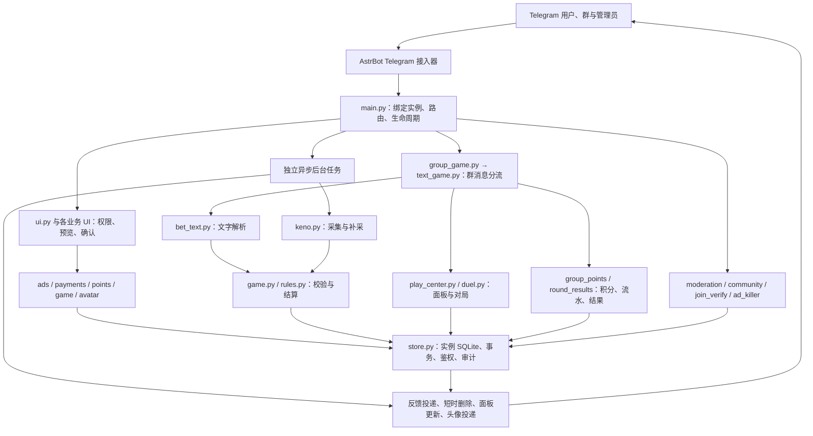

# 功能说明与运行架构

核对日期：2026-09-26。本文供维护和业务管理员阅读，不导入玩家客服知识库。

## 管理入口

| 入口 | 用途 | 边界 |
|---|---|---|
| 全部功能启停 | 广告发布、玩法中心、积分获取、群管理及各玩法总开关 | 不配置逐群参数；广告充值仍使用独立后台配置 |
| 广告管理 | 广告位、订单审核、核款、投放目标和异常核查 | 内容审核不等于收款；自动说明不代表外部到账核验 |
| 积分管理 | 签到与聊天奖励、人工调整 | 按群账本隔离；调整须指定群、用户和原因 |
| 玩法管理／加拿大28 | 倍率档位、限额、开放时段、采集异常 | 总开关之外仍校验群状态、余额、数据时效和封盘 |
| 玩法管理／积分快三 | 逐群启停、近期8期、骰子投递及异常退款 | 未知发送不重掷；仅待核查且未结算期可退款 |
| 玩法管理／逐群对赌 | 当前群对赌启停、进行中数量 | 还受玩法中心和对赌总开关约束；不扣积分、不担保彩头 |
| 玩法管理／其他互动玩法 | 转盘、老虎机与扫雷的逐群开关、桌次和异常 | 各玩法总开关与逐群开关互不覆盖 |
| 玩法管理／本群玩法启停 | 汇总本群各玩法开关与阻塞原因，确认后一次开启本群五项独立玩法 | 不改总开关、其他群或加拿大28倍率；保留既有档位与限额 |
| 群管理 | 登记群、群策略、处罚、广告检测、入群验证、举报 | 业务授权和 Telegram 实际群权限均需满足 |
| 专属头像管理 | 制作开关与任务查询 | 数字 UID 累计额度，不按群重复赠送 |
| 授权与撤权 | 授予／回收业务管理权限 | 仅首位超管，业务管理员不可转授权；不授予服务器登录权 |

## 开关不是删除数据

- 关闭玩法后，已受理订单及已锁定对赌仍按保存的规则处理；不退款撤单、不改历史结果。
- 关闭积分获取，不清空余额，也不停止已有订单的结算入账。
- 关闭广告发布，已有广告到期清理仍运行。
- 关闭玩法中心同时暂停未来追号。关闭群管理会关闭定时禁言和广告杀手策略；重新开启总开关不自动恢复这些策略。
- 对赌配置和挑战按群隔离。首次迁移继承已登记群的启用状态，之后新增群的对赌默认关闭。
- 头像提交、轮询、成品投递是独立任务；未知发送结果不自动重发。

## 开启本群玩法

1. 「玩法管理 → 本群玩法启停」选群，查看总开关、本群开关及实际阻塞原因；显示“配置就绪”不替代成员、封盘、数据和余额校验。
2. 「开启本群全部玩法」预览后确认，原子补齐转盘、老虎机、扫雷、快三、对赌的本群开关；保留已有档位、冷却、次数、赔率和积分。
3. 本群老虎机与扫雷新版准入同时明确确认；单项开启也在预览中说明此范围，不再要求另行编辑隐藏名单。两个玩法的开关仍独立，其他群不受影响。

总开关仍只在「全部功能启停」调整。总开关关闭时可以准备本群配置，但不会开始新业务；新增群仍默认关闭，不因登记或管理员授权自动开放。旧确认遇到配置变化会拒绝，不覆盖其他管理员操作。

## 实际组件图

这是一套插件内的异步模块，不是多套独立微服务。`Main` 复用已绑定的 Telegram 接入，不额外启动第二个 polling。后台循环与业务入口分离，不用并行线程写共享 SQLite。

## 数据及权限边界

- **机器人实例**：平台 ID 对应独立数据库目录。
- **群积分**：`group_wallets`、`group_ledger` 按群和用户隔离。
- **对赌**：`duel_groups` 保存逐群开关，`duels` 保存群、双方、期号和规则快照，`game_panels` 保存面板投递状态。
- **反馈与删除**：`gt_requests`、`gt_delete` 持久化发送和撤回状态；不能猜测未知消息 ID。
- **授权**：插件业务角色、对应群范围、Telegram 实际权限分层核验；显示按钮不代表一定获准执行。
- **资金边界**：广告余额与积分账本分开；对赌没有扣积分或自动履约机制。
- **外部依赖**：Telegram、Keno、头像上游、充值扫描可能分别失败；不将模型当作下注解析器或扣分决策器。

## 维护检查顺序

数据库垃圾清理及索引维护见[操作手册](database-maintenance.md)。先只读预览和一致性备份，后执行白名单清理；测试订单若已产生积分或收款，仍按业务证据保留，不能直接删单。

1. 查总开关，再查群启用、逐群开关和业务参数。
2. 查角色有效期及 Telegram 实际群权限。
3. 查数据时效、任务状态和失败原因，区分业务拒绝与网络失败。
4. 对未知发送先核查，不自动重发；只清理有精确 ID 的机器人消息。
5. 修改前做一致性快照；热加载等待后台退出，不覆盖整库回滚新流水。

## 多群主共用机器人

「我的群」是群主的本群入口；「平台接入总控」只对平台超管显示。群主只能看到自己经营的群，所有按钮回调和后台任务仍会重新校验经营主体、群 ID、版本和 Telegram 权限。

新增群默认关闭。启用前依次确认：平台总开关、本群服务、本项功能、群主身份、机器人权限和业务数据状态。显示“平台允许”不等于本群已启用。

本群服务关闭时，群主仍可进入转盘、快三、老虎机和扫雷管理页，预先配置运营参数及查看记录；保存参数不会自动开启本群服务或接受下注。身份、归属和机器人权限照常核验。老虎机显示本群开桌档位，同桌与发起者同额；扫雷显示本群加入档位。

广告独立链路为“审核 → 预留 → 付款 → 核款 → 发布”。历史平台广告余额继续只服务平台业务；新经营者直付广告不经过旧余额，也不进入游戏积分。到账异常只进入核查，不自动发布。

付费 AI／制图预算只由平台超管按群授权，预算为次数上限而不是金额额度；调用身份、群、资源和次数写入审计，重复操作不重复消耗。未授权或预算耗尽时应拒绝请求，不回落到其他群或平台余额。
