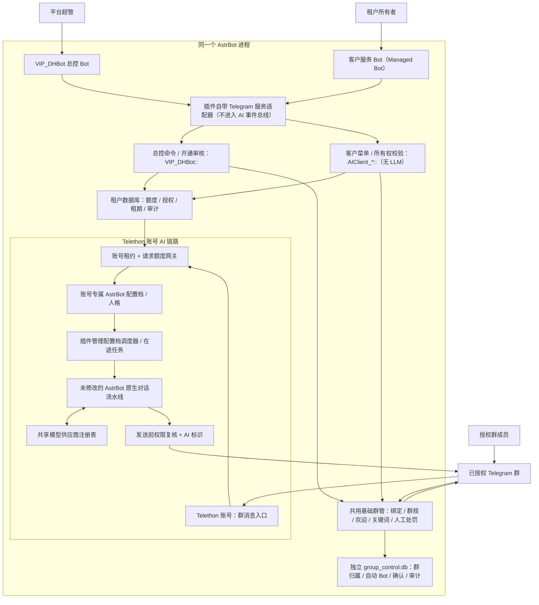

# AI 账号服务总控

`astrbot_plugin_telethon_ai` 将 Telegram 服务入口、基础群管、租户授权和 Telethon AI 账号接入同一个 AstrBot。VIP 总控负责平台运维；客户拥有的服务 Bot 提供本租户菜单和绑定群的规则型群管；获授权的 Telethon 账号才会使用 AstrBot 的模型处理群内触发的对话。本插件不提供客户 Web 管理端或独立 HTTP 服务。

## v0.5.2 授权额度与账号统计

账号不再设每日请求上限；旧平台配置中的 `daily_limit` 仅为历史遗留值，校验、接纳、状态显示与通知均不使用，不需要手动改成很大的数字。新账号配置不包含该字段。状态接口 `daily_limit: null` 表示账号无日配额，`quota_scope: tenant_authorization` 表示按业务授权限制，不能解释为无限租户权益。

账号页“今日请求（UTC）”只显示接纳次数和统计日切换时间。实际可用请求由对应服务授权的累计 `budget`、有效期限、账号租约、群与发送者授权及暂停状态决定。请求先预留租户额度，发送前再核验；额度耗尽和服务到期仍停止 AI，续期申请不会自动增加预算。累计额度不会随 UTC 日期切换清零。

保留账号发送冷却、去重、在途请求限制、Telegram 限流处理、紧急停用和 AI 身份说明；冷却不会因午夜跨日绕过。账号统计不是模型 token 计费，也不是保证成功投递的次数。旧账号每日额度通知不再生成；历史记录与审计保留，尚未发送的旧日额度通知取消，不重放投递结果不确定的记录。

## v0.5.1 公共授权与基础群管

总控与克隆共用基础群管模块，不增加独立插件或修改 AstrBot 核心。客户 Bot 仍没有通用 AI；欢迎和关键词均为确定性规则，不调用模型、不消费 Telethon AI 额度。群管绑定独立于 AI 群授权，绑定不会分配账号、允许账号入群或开启 AI。

总控兼任公共群管入口，不要求用户拥有付费租户或平台超管加入该群。“任何人可以使用”指任何群均可由其当前群主或管理员授权，不代表普通成员可以处罚别人。公共授权只对该群有效，不改变插件 `admin_ids`、AI 账号授权或租户归属。

| 权限 | 普通成员 | 本群当前管理员 | 克隆所有者 | 平台超管 |
| --- | --- | --- | --- | --- |
| 群规与帮助 | 可查看 | 可查看 | 按群身份 | 按群身份 |
| 公共 Bot 绑定、规则、欢迎、关键词、解绑及本群自动 Bot | 不可操作 | 仅本群，实时核验 | 按群身份 | 按群身份 |
| 人工删除、临时禁言、解禁 | 不可操作 | 仅本群，核验 Bot 实际权限 | 按群身份 | 按群身份 |
| 克隆服务状态、暂停与续期/授权申请 | 不可代替他人 | 不因群权限获得 | 仅自己的服务 | 平台审核 |
| 账号登录、账号分配、AI 配置、租期/额度修改、全局停用 | 不可操作 | 不可操作 | 不可自行修改 | 仅平台运维入口 |

生产平台初始超管为 `1000000001`。加入群、绑定公共群管或成为某租户所有者均不会自动加入超管名单。Bot 头像/名称属于 Bot 品牌设置，不是群欢迎语；当前尚无克隆头像修改菜单，不应向普通群管理员开放总控品牌修改。

### 绑定与入口

1. 先在 Bot 私聊发送 `/start`，再由群主手动添加 Bot 并授予管理员权限。删消息需删除权限，禁言需限制成员权限；不要求授予提升管理员的权限。
2. 当前群管理员在群内发送 `/bindgroup@Bot用户名`。公共总控 Bot 向发起人发送五分钟、单次、本人确认，不要求平台超管审核或成为群管理员。克隆仍向该 Bot 的服务所有者确认，要求有效租期。确认时重新核验确认者与 Bot 的当前群管理员身份。
3. 私聊 `/groups` 或“群管理”选择群。公共群管的当前管理员可管理本群规则、欢迎、关键词、解绑及自动 Bot，解绑与自动 Bot 仍需二次确认。克隆的普通群管理员仅配置规则、欢迎、关键词和处罚；克隆绑定关系、解绑与自动 Bot 仍由克隆所有者控制。
4. 公共 Bot 不占用付费克隆归属或 AI 群名额，取消原总控全平台 50 群限制；私聊列表仅查询该用户曾核验的群，每次仍实时核验，最多展示 50 项。新管理员可在已绑定群发送 `/groups@Bot用户名`，核验后收到私聊菜单；不会扫描或泄露其他群。不同克隆所有者仍不能共同绑定该群，同一所有者可绑定多个克隆。每克隆按 `group_limit` 独立计数。
5. 同一群无论公共/克隆共存都只指定一个自动执行 Bot，默认未指定，欢迎与关键词均关闭。本群公共管理员或克隆所有者手动选择其正在使用的 Bot，再显式开启功能。其他 Bot 仅响应明确带自身用户名的命令，不自动接管，不改变 AI 账号分配。

私聊“群管理”提供群规、欢迎语、关键词、自动执行、解绑和操作记录。公共群管理员、克隆所有者与克隆普通群管理员看到不同的操作范围。配置输入有效期五分钟，可用 `/cancel` 取消；未点击编辑按钮时普通私聊文本不会被当成配置。规则与欢迎文本最多 3000 字；不解析 HTML。

公共群权限核验失败时关闭管理入口，不沿用首次授权人的旧身份。克隆所有者仍可查看自己的本地绑定并二次确认解绑，不会修改 Telegram 群权限；普通管理员不能通过此路径更改克隆归属。v0.5.0 的旧平台专属绑定保留为非公共记录，不静默转换；运营需要先复核、解绑后重新公共授权。

关键词格式：`精确|关键词|回复内容` 或 `包含|关键词|回复内容`，最多 50 条，关键词最多 100 字、回复最多 3000 字。精确匹配优先，其次最长包含匹配，再按登记顺序；每条消息最多回复一次，同一群十秒内最多自动回复一次，人工切换自动 Bot 也沿用该群冷却时间。关键词列表可逐条确认删除，不开放正则或任意代码。欢迎仅处理实际新成员事件，不因普通消息或重载补发。

### 群内命令

| 命令 | 使用范围 |
| --- | --- |
| `/rules@Bot用户名`、`/help@Bot用户名` | 已绑定群内公开查看群规与帮助。 |
| `/bindgroup@Bot用户名` | 当前管理员发起；公共 Bot 本人确认，克隆由服务所有者确认。 |
| `/groups@Bot用户名` | 当前群管理员打开本群私聊菜单，适用于尚未登记的新管理员。 |
| 回复目标消息发送 `/del@Bot用户名` | 当前管理员删除该消息，需 Bot 具有删除权限。 |
| 回复目标消息发送 `/mute@Bot用户名 10m` | 超级群临时禁言；支持 `m/h/d`，一分钟至七天，需 Bot 具有限制成员权限。 |
| 回复目标消息发送 `/unmute@Bot用户名` | 仅解除本模块、此 Bot 记录且尚未到期、未被外部修改的禁言。 |

所有群命令必须指定 Bot 用户名，不响应无目标或其他 Bot 的命令，防止多 Bot 重复执行。拒绝处罚群主、管理员、Bot、匿名发送身份和已经受限的成员；不支持永久封禁、批量处罚或修改他人既有禁言。解禁移除个人限制，成员仍受当前群默认权限约束，不修改群权限；操作后回读确认成员恢复正常，未核实则保留禁言记录并进入人工复核。

### 生命周期与审计

AI 暂停或请求额度耗尽不停止基础群管；公共 Bot 不依赖克隆租期，整体克隆租期到期后不接受其新配置、自动回复或新增处罚，保留查看、续期申请与所有者解绑。Telegram 临时禁言使用明确到期时间，不依赖本插件补跑解禁任务。卸载、Bot 被移除/降权、权限核验失败或投递不确定会停止自动功能；每三十秒轮询检查，每轮最多 32 项自动入口，批次轮转。克隆由总控通知绑定所有者，公共入口异常通知平台超管，不自动切换另一个 Bot。

群管数据为 `group_control.db`，包括归属、公共/克隆绑定、逐 Bot/群配置、菜单发现提示、五分钟单次确认、操作与审计；菜单提示不是权限缓存。公共绑定保留首次授权人的 ID 用于审计，不赋予其永久群主或平台身份。公共绑定与克隆独占归属分开，但共用该群唯一自动 Bot 和冷却时间；解除最后一项克隆绑定即释放克隆归属，公共绑定继续保留。数据库不保存 Bot Token、模型密钥或其他租户配置。群消息去重和处罚记录持久化，启动把中断发送标为不确定，不重复执行。存在未核实处罚的目标拒绝新处罚；运营需要先核验 Telegram 实际状态，目前没有自动重放或自动解除复核标记的入口。

插件页面“群聊”分别展示 **Telethon AI 群授权** 和 **基础群管**，仅只读显示群名称、群号、归属、Bot、自动执行、开关与异常数量；配置操作在 Telegram 内完成。此页面仍仅供已登录后台管理员。

升级前备份原配置、业务库、额度库、群管库、密钥和会话，保留 v0.5.0 包。仅重载此插件，并逐台重载总控/客户服务平台以更新菜单及订阅：客户为 `message/callback_query/my_chat_member`，总控额外保留开通和支付预检查事件。无关生产 Bot 不重启，原有租期与额度不改变。新绑定、欢迎、关键词和处罚均不自动启用；回滚前先停群管入口，保留新库和审计，不用旧数据库覆盖新业务。旧 v0.5.0 不理解公共权限标记，不得直接读取已出现公共绑定的新版群管库；回滚时保持群管停用并人工复核，不丢弃新审计。

开发验收入口为 `integrations/telethon-ai/test_group_control.py` 和 `verify_clean_runtime.py`。前者覆盖多所有者、多 Bot、撤权、伪造/过期确认、租期与 AI 额度独立、匹配优先级、逐群限流、持久去重及处罚冲突；后者在未修改官方 v4.28.1 核心中使用模拟 Bot API 验证实际群绑定、所有者确认、群规与不进入 AI 队列。模拟测试不能代替真实群权限、删消息和临时禁言验收。发布脚本为 `deploy_group_control.py`，默认只做预检查，`--apply` 才备份并重载；安装包白名单不包含密钥、业务库或账号会话。

> **安装兼容性：**v0.4.0 提供插件自带的 `telethon_ai_service` 平台及原生 AI 流水线生命周期，不再要求修改 AstrBot 的 Telegram adapter 或 EventBus。2026-10-01 已在未修改的官方 v4.28.1、独立数据目录、断网环境验证完整核心启动、模拟 Telegram 命令、客户开通、原生模型/人格回复、页面鉴权及热重载。测试使用模拟凭据和模型，不等于真实 Telegram、付费流程、所有版本或所有机器的兼容认证。旧 `type=telegram` 总控仍需要本地 hook，必须经过备份和停轮询后迁移；本 ZIP 不包含核心或 WebUI 补丁。

## 架构

箭头表示**管理或消息流**，不是共享管理员权限。总控 Bot 不替 Telethon 账号发言，客户服务 Bot 也不直接生成群聊回复。普通克隆是在**同一个 AstrBot** 中增加一个受限的 Telegram 平台和配置档，不是按客户复制完整 AstrBot/数据库；租户在业务数据库内按所有者、Bot、账号租约和群授权做逻辑隔离。它不是抵御不可信 Python 插件的进程级隔离，高隔离定制需要另外部署。

### 模型、人格与知识库

| 范围 | 当前行为 |
| --- | --- |
| `VIP_DHBot::` 总控配置档 | 决定总控 Bot 的 AstrBot 行为；当前生产配置关闭自动 LLM，由总控插件处理服务命令。 |
| `AIClient_*::` 客户配置档 | 仅为客户服务 Bot 提供管理菜单；不启用自动 LLM，不承载 Telethon 群聊。 |
| `TelethonAI_<账号>::` 账号配置档 | 每个账号独立路由、人格、会话和允许的插件；启用 LLM 后由 AstrBot 原生流水线调用模型。 |
| 模型供应商与密钥 | 同属一个 AstrBot 的供应商注册表。创建账号配置档时，可用插件指定的模型 ID；留空时**读取当时**总控配置档的模型 ID 作为初始值。后续修改 VIP 模型不会自动同步已有账号配置档。 |
| 人格与知识库 | 账号首次建档可用 `SOUL.md` 建立其独立人格；之后各账号分别维护。总控人格不会自动复制。当前账号配置档的 `kb_names` 为空，账号链路不接入总控知识库；并限制工具调用。 |

因此，“复用 VIP 配置文件的对话模型”只指初次建档时选用的**模型 ID**及同一供应商资源，不是复用总控的整份配置、提示词、聊天记录或知识库。生产实例实际使用什么模型应以各账号配置档当前值为准。

### 原生配置页的角色边界

v0.3.11 引入的可选配套界面，在当前扩展底座的 `/config` 中按**实际平台路由与业务登记**识别角色，不按可重命名的配置档名称猜测。它不属于 v0.4.0 安装包自动提供的原版 UI：

| 配置档 | 配置页 |
| --- | --- |
| 总控，`controller_mode=standalone` | 展示路由、AI 开关、知识库和插件范围等只读状态。该模式独占 Telegram 更新，普通消息不会进入原生 AI 流水线，因此不提供会误导的模型、人格、知识库或扩展编辑。业务参数在插件配置、Telegram 管理命令和业务库中维护。 |
| 客户克隆 Bot | 展示只读隔离状态，不提供原生 AI、工具、插件安装或管理权限设置。用户仍通过自己的 Telegram Bot 管理服务。 |
| Telethon AI 账号 | 保留模型、人格、上下文压缩、提示词/时间/身份信息、文本前缀、速率限制与内容安全。隐藏当前文字对话链路未开放的知识库、语音、工具、第三方执行器、群聊主动回复等设置；不显示不适用此适配器的群名称、原生会话隔离、@/引用回复开关。AI 开关可用于停止/恢复原生模型处理，不改变租户授权与账号连接。 |
| 其他生产 Bot、默认配置、系统配置 | 保留原生页面，不套用账号服务角色限制。`companion` 模式的总控同样保留原生配置。 |

配置页中的“插件配置”原本是**配置档允许加载的插件集合**，不是插件自身的 `_conf_schema.json` 参数。账号服务配置档固定使用本插件，不在这里另行装工具；人格内容仍在 AstrBot 人格库维护。

策略由插件注册到配置管理器；当前底座的 `ConfigProfileService` 调用其展示、保存和删除校验。前端只显示可编辑字段，但保留原配置所有隐藏值；JSON 编辑和新旧配置保存 API 也必须经过后端校验，不能借此更改插件范围、管理员、知识库或执行器。仍绑定服务或账号的配置档不可直接删除；同一配置档同时绑定不同角色或其他 Bot 时显示路由冲突并禁止编辑，不会替运营自动改路由。

这是**配置入口的防误改与逻辑边界**，不是进程沙箱：修改服务器文件、路由、业务库、安装任意 Python 插件的运维人员仍拥有底座权限。运行时所有权与发送前校验仍是必要保护。原版 AstrBot 未实现上述可选策略 hook 或未安装配套前端时，不具备此角色化配置页；本插件 ZIP 不夹带核心或 WebUI 补丁。

## 功能边界

- **总控：**管理员审核试用、登记客户 Bot、分配账号、授权群、启停服务、审核恢复与群授权申请、查看续期申请和紧急停止。续期申请当前不能通过自动审核命令直接续期。Managed Bot 创建需由用户通过 Telegram 确认，不能自行凭空生成客户 Bot。
- **客户服务 Bot：**服务与额度、暂停服务、申请恢复/续期和 AI 群授权申请仍仅绑定所有者可用；基础群管另按已绑定群的实际管理员身份授权，不提供模型密钥、人格、其他客户数据或平台运维入口。Bot 身份、发消息的用户 ID 和所在私聊均在后端重新校验。新 Bot 使用插件自带服务适配器，拒绝把更新提交给 AstrBot AI 事件总线，也拒绝通用主动发送接口。插件未就绪或卸载时停止轮询，未处理的消息留在本适配器，不向其他插件转发。旧入口迁移前仍需 `telegram_dedicated_reporting=true` 等本地隔离开关。
- **Telethon AI：**仅处理明确授权的群和发送者在允许条件下的提及/回复；不主动聊天、自动入群或邀请账号，不将账号间消息循环传递。输出带 `[AI]` 标识，不能把它当作未披露的真人聊天服务。
- **额度：**只按租户授权的累计请求总额度控制，账号不设 UTC 每日请求上限，保留发送冷却与安全停用。每日计数是网关接纳次数，并非模型 token 消耗或所有成功发言数。发送前还会复核租期、租约、群授权与暂停状态。不确定是否已发送时暂停并人工复核，不自动重试发言。
- **商业化：**当前只开放管理员审核的试用。Stars 购买、自动收款、续费与退款尚未启用；不要把 `/plans` 或“申请续期”当作已开通付费能力。

租户“已启用”、账号“已连接”、群“已授权”和账号“未紧急暂停”是不同条件；其中任何条件不满足都不代表可以发言。后台解除紧急暂停不会自动连接已经停止的 Telethon 平台。

账号每日用量按 UTC 日历日统计，UTC 00:00（北京时间每天 08:00）进入新的一天，无需定时清库；页面显示下一次统计日切换的北京时间，不是额度恢复时间。租户累计额度不会每日清零，到期也不会因统计日切换自动续期。页面可见且没有授权/确认弹窗或正在试聊时，每 30 秒刷新状态；回到页面时立即刷新，不修改额度和授权。

## Telegram 入口

总控 Bot 的公开私聊命令：`/start`、`/help`、`/bots`、`/create`、`/plans`、`/groups`。`/create` 需要有效试用资格及总控 Bot 的 Bot Management Mode。

总控超管命令**只接受插件 `admin_ids` 配置的数字 ID 的私聊**：

| 命令 | 用途 |
| --- | --- |
| `/tgai help` | 查看平台管理帮助。 |
| `/tgaigrant OWNER_ID DAYS` | 签发 1–7 天的试用资格。 |
| `/tgaitrial OWNER_ID BOT_ID AIClient_NAME` | 人工登记已有服务 Bot。 |
| `/tgaiassign TENANT ACCOUNT` | 分配账号租约。 |
| `/tgaigroup TENANT -100GROUP` | 审核通过后授权群。 |
| `/tgaienable TENANT`、`/tgaidisable TENANT` | 启用或暂停租户服务。 |
| `/tgairetry BOT_ID` | 复核后重试未完成的开通。 |
| `/tgairequests`、`/tgaiapprove REQUEST_ID`、`/tgaireject REQUEST_ID` | 处理客户申请。 |
| `/tgaistop` | 紧急停止账号 AI 发言。 |

变更型管理命令除紧急停止外采用绑定发起人、聊天和参数的五分钟单次确认；确认状态在进程内，重载后需要重新发起。平台操作记入业务审计。

客户服务 Bot 在私聊支持 `/start`、`/service`、`/pause`、`/resume`、`/renew`、`/bind -100群ID`，以及“我的服务”“查看额度”“暂停服务”“申请恢复”“申请续期”等键盘操作。群授权申请**不等于**获得授权，平台必须核验群管理权和授权范围；服务 Bot 不会自动邀请 Telethon 账号入群。

## 安装和配置

1. 准备 AstrBot（当前隔离验证版本为官方 v4.28.1）与模型供应商。安装本 ZIP 和 `requirements.txt` 依赖，仅加载一次，不复制生产数据或核心补丁。首次加载时总控平台尚不存在可以正常登记插件。
2. 插件配置填写 `control_platform_id`（例如 `VIP_DHBot`）、超管数字 `admin_ids`、`support_text`，使用 `controller_mode=standalone`。在 AstrBot“机器人 → 新增”选择 **AI 账号服务 Bot（总控 / 克隆）**，平台类型 `telethon_ai_service`，ID 与插件配置一致、`service_role=controller`，填写运营自己的 Token 后启用。隔离字段保持默认：必需插件为本插件、专用上报开启、原生命令注册和自动刷新关闭。不要选择原生 Telegram 类型后假设原版具备旧 hook。托管开通前在 BotFather 开启 Bot Management Mode。
3. 建立总控独立配置档，绑定 `VIP_DHBot::`，关闭自动 LLM、内置命令和知识库，`plugin_set` 只允许本插件。`provision_profiles` 控制首次为私有账号注册表建档；`model_provider_id` 可固定新账号初始模型，留空只在首次建档时读取总控配置档模型 ID。账号拥有独立配置档和人格，不复制总控知识库。新客户平台由开通流程创建为 `telethon_ai_service`、`service_role=customer`，订阅消息、按钮回调和自身成员状态；客户配置档关闭 AI、内置命令、管理后台和知识库，管理员为空、只允许本插件。
4. 在内部插件页面的“账号 → 添加账号”输入自有账号别名、带国际区号的手机号和 Telegram API ID/API Hash，随后输入 Telegram 验证码及必要的两步验证密码。也可在服务器终端使用 `setup_account.py`，完成后点击“同步登记”。初次建档检查 `TelethonAI_<账号>::` 路由、模型和人格；账号平台默认关闭，需要在授权群和租约确认后按需开启。
5. 平台超管发放试用资格，客户在总控私聊 `/create` 并确认新 Bot；待注册、账号分配、群授权和账号连接分别核验后再做小范围测试。
6. 运行状态可在 AstrBot 内部原生插件页面的“账号 / 授权 / 群聊 / 回收桶 / 诊断 / 试聊”查看。该页面供平台内部维护；客户所有服务入口均在 Telegram，不需要租户域名或对外 WebUI。“正在连接”表示页面正在连接 AstrBot 页面桥或状态接口，**不是** Telethon 账号正在登录。加载失败可重试；单凭 URL 的未授权标记不能判定故障原因。

### 原生 AI 生命周期

账号消息经过额度预留和授权检查后，由插件按实际 UMO 路由获取账号配置档，调用 AstrBot 原有 `PipelineScheduler`，不是自行拼接一个独立 LLM 请求。仍使用 AstrBot 的模型供应商、人格、会话和原生阶段；配置内容改变后按配置签名重建调度器，不依赖 EventBus 私有补丁。默认配置回退、开放插件、知识库、管理员权限、非本地执行器均被拒绝。最多四个在途请求，包含排队的总时限 110 秒，卸载取消在途请求并清除缓存。

请求失败且尚未开始发送时释放租户额度预留；发送已经开始但结果不确定时保留不确定记录并暂停账号，不自动重试。账号每日计数统计网关接纳，失败释放租户额度不回退每日接纳次数。

### 旧入口迁移

先完整备份平台配置、配置档、插件配置、业务库、额度库及私有密钥/账号资料，并保留旧安装包。记录正在运行的账号和无关 Bot 状态。停用待迁移 Bot 的旧平台，确认旧轮询结束；然后重载插件，在原平台 ID、原 Token、原配置档路由上更改 `type=telethon_ai_service`，总控角色 `controller`、客户角色 `customer`，隔离字段保持默认，再逐台恢复原启用状态。不得同时创建第二个使用同一 Token 的平台；适配器会检查重复配置、跨进程锁和既有 Webhook。

新接入不会重新创建 Bot 身份、续期、增加额度、启用停用账号或邀请入群。插件重载会关闭原有 Telethon 连接，维护后仅恢复此前确实运行的账号。回滚先停新入口，再恢复旧插件及旧平台配置，不恢复陈旧数据库覆盖期间的新业务。插件页诊断显示当前实际接入方式；仍是旧 `telegram` 类型时不能把新 ZIP 安装视为已完成迁移。

## 数据、安全与迁移

### 页面账号登记

页面按对象分开：

- **账号：**仅显示登记账号及账号 ID、连接状态、AstrBot AI 配置、每日请求与停用操作；不混入内部租户编号、开通用户或群授权。“AstrBot AI 配置”分别标注实际路由命中的配置档名称、对话模型和人格 ID，不把人格 ID 当成插件独立 AI。配置档元数据读取 AstrBot `get_conf_info`，人格选择读取 `agent_runner.config.persona.persona_id`；人格内容仍在 AstrBot 原生人格库维护，不在状态接口展示系统提示词。
- **授权：**显示开通用户、分配的 Telethon AI 账号、管理 Bot（克隆）、服务状态、累计额度和到期时间。这是账号与开通用户的对应关系。
- **群聊：**显示群名称/群号、开通用户、管理 Bot（克隆）、Telethon AI 账号、成员授权和使用状态。这是用户在群里使用账号的范围；分别标记到期、暂停、配置不全、额度不足和未获用户群授权。只配置在账号上的群不等于已有用户授权；“配置就绪”也不保证 Telegram 群成员权限或每条消息都能触发回复。
- **回收桶：**显示已到期服务、保留的账号分配、历史群授权、剩余额度和到期通知状态。到期服务从正常授权与群聊视图移走；数据不删除、账号不自动重新分配，避免在途消息和历史记录串租户。未来经运营审核更新有效期限后会自动回到正常视图，不会自动收款或续期。正常与到期记录各最多显示 100 项，分别统计总数。

用户优先显示 `@用户名`，保留 Telegram 数字 ID；未设置用户名或名称查询不可用时明确回退。用户名称通过已有总控 Bot 按数字 ID 只读查询，单次最多 32 个、并发 4、总预算 3 秒，成功缓存十分钟、失败缓存至少一分钟；Telegram 限流时延后重试。账号用户名优先读取已有连接，未连接的账号只使用可获取的身份展示信息，不自动启动会话。数字 ID 才是权限依据，用户名不参与账号分配或群授权。

`collector`、`keywords` 是平台的账号内部别名，不是 Telegram 用户名；页面将其显示为“平台别名”。“分配的 Telethon AI 账号”就是以前的“已授权账号”，指代表用户在授权群里提供 AI 对话的账号，不是第三类账号。“管理 Bot（克隆）”则是该用户在 Telegram 操作服务菜单的 Bot，和 Telethon 用户账号是两种身份；其用户名来自同一所有者的托管 Bot 登记记录。

### 到期与额度通知

总控 Bot 每 30 秒扫描业务状态，将到期、授权累计请求额度用完通知发送到服务绑定所有者的 Telegram 数字 ID 私聊；账号日用量只作统计，不触发额度通知。没有群广播、Telethon 主动发言或模型调用。开通用户必须能够接收总控私聊；拉黑总控或从未建立可用私聊会导致通知不可达，页面“诊断 → 用户通知”显示结果。

通知写入业务库 `notifications` 表。到期按服务到期周期去重，累计额度按服务周期与预算去重；旧账号日额度通知仅保留历史展示，不再生成或投递。发送前重新核验所有者、Bot、期限与用量条件；续期、释放用量或绑定身份改变后，旧的待发送通知取消。首次启用会为当前已到期或已用完额度的服务补发一次提醒；到期通知不表示删除克隆身份，管理菜单和续期申请仍保留。

后台通知任务不依赖页面打开。发送成功保存消息 ID；Telegram 明确限流时按等待时间重试；接收者不可达会标为“无法联系用户”；网络错误、超时、发送中断或进程崩溃后的在途通知标为“待人工复核”，不自动重复发送，避免用户收到重复提醒。管理员需结合 Telegram 投递情况处理这些记录，目前没有自动重发不确定通知的操作入口。插件卸载前取消通知任务，再关闭业务库；历史记录和审计保留。

新增接口仅允许后台登录管理员，拒绝 API Key 身份；客户 Bot 不接收登录凭据。请只通过受保护的 HTTPS 后台或本机访问此页面。

“群聊”按群逐条显示**群名称与群号**。名称仅从该账号已连接的 Telethon 客户端查询其配置中已有的授权群；不会另开账号连接、加入群、读取群消息或改变授权。单次刷新最多查询 32 个群、并发上限 4、总查询预算 3 秒；成功缓存五分钟，失败或 Telegram 限流时延后重试。账号断开时标记缓存名称；没有名称时显示“群名称未获取”与明确的群号。缓存仅在插件内存中，重载后重新获取；群名称只是展示信息，不参与权限判断，不借用其他租户账号的名称。

每次登录申请绑定当前后台用户名，有效期五分钟；同一插件同时只接受一次申请，验证码发送至少间隔 60 秒，每次申请最多验证五次。取消、过期和卸载会断开临时连接；验证码与两步验证密码不写入账号注册文件。临时授权使用独立内存 Session，不复用正在运行的账号会话；成功后才保存权限为 `0600` 的专用 Session 和账号注册文件。同一 Telegram 用户不能重复登记，不支持上传任意服务器路径。

添加成功只创建独立人格、配置档与**停用状态**的平台，不启动连接、不分配租户、不授权群。配置同步失败时账号仍已登记，修正模型或路由后点击“同步登记”；该操作不会重载整个插件，也不会改变已有账号的连接开关。页面刷新不会恢复未完成的登录表单，需要等待原申请过期后重新申请。

v0.3.5 的模拟授权与安全测试已通过；真实新增手机号的完整 Telegram 授权仍需使用由运营控制的新账号验收。

插件数据位于 AstrBot 的 `data/plugin_data/astrbot_plugin_telethon_ai/`：租户业务及额度记录为 SQLite，`private/` 保存账号注册信息、会话引用和 Managed Bot 密钥。Managed Bot Token 在业务库中加密，但 AstrBot 原生 Telegram 平台配置也会保存可用 Token，因此**整个 AstrBot 数据目录都要按敏感资产保护**。不要将数据库、密钥、平台配置或 Session 打进插件 ZIP。

备份/恢复应同时覆盖业务库、额度库、Fernet 密钥、账号注册表、Session 与 AstrBot 平台/配置档，并校验对应关系；单独恢复数据库可能使 Bot Token 不可解密或路由失配。插件重载会断开账号连接，维护后须检查账号平台是否重新运行。旧总控、旧试验实例及遗留 worker 不应与本插件同时轮询同一个总控 Bot。

旧客户 Bot 若缺少上述平台隔离开关，必须先备份并由平台运维通过 AstrBot 原生 Bot 配置更新接口单独重载该客户 Bot；仅改磁盘文件不会改变已运行适配器的 `required_plugin`。新代码拒绝在旧配置上直接重试开通，不会静默开启不安全的客户 Bot。该设置仍属于同进程的**逻辑边界**，不能隔离拥有任意代码执行权的插件或维护人员。

## 兼容性与验收状态

- v0.4.0：2026-10-01 在官方 v4.28.1 固定提交 `ab42c0d9b726d82ad0f9563e04c53a4460c00d61` 的未修改源码、独立 Python 3.12 环境中解压安装包，使用 `unshare --net` 阻断网络。完整核心启动、插件自带总控轮询、模拟总控命令、动态客户开通及幂等、所有者拒绝校验、配置档热更新、原生模型/人格回复及额度结算、插件页面与 API 鉴权、热重载和卸载均通过。仅模拟外部 Telegram 请求与模型供应商，未替换 AstrBot 核心、插件或原生流水线。复现程序为 `integrations/telethon-ai/verify_clean_runtime.py`；断网造成官方元数据查询失败属于预期，不表示真实网络验收通过。
- v0.4.0 在本机通过 294 项配置、路由、网关、账号服务及 Telegram 回归测试；新增用例覆盖服务消息不进入 AI 总线、错误不泄露凭据、配置档拒绝回退、调度器随配置更新、卸载取消任务，以及取消发送后保留不确定额度并暂停账号。JavaScript 语法检查与新增 Python 文件 Ruff 检查通过。
- 2026-10-01 生产切换完成：仅 `VIP_DHBot` 和既有测试克隆 `AIClient_8910402926` 从原生 Telegram 类型迁移到 `telethon_ai_service`，ID、Token、配置档路由及租户业务数据保留；collector 恢复运行、keywords 保持停用，无关 Bot 的启动时间和运行状态不变，未重启整个 AstrBot。Telegram 只读 API 核验两台 Bot 身份、无 Webhook、命令菜单，总控 BMM 开启。后台页面六个标签及账号添加弹窗在桌面/手机通过，原有角色配置页继续正常；该轮没有新 Bot 创建、续期、模型调用或 AI 群发言。私有备份及旧 v0.3.11 包保留在服务器，不纳入 ZIP。
- v0.3.11 已在当前扩展底座通过 275 项配置、路由、账号服务和 Telegram 回归测试，前端类型检查与构建成功；在本机认证浏览器完成总控、Telethon、克隆与无关生产配置档的桌面/手机页面验收。真实配置保存 API 已验证拒绝为克隆开启 AI，配置未被写入；部署前后对照确认原生配置、租户期限和额度保持不变，collector 恢复运行、keywords 保持停用。该轮没有模型调用或群发言，不代表原版 AstrBot 安装兼容性认证。
- v0.3.x 的历史失败属实：原生 Telegram adapter 缺少本地 hook，旧版本不能完成原版总控工作流。v0.4.0 以插件自带平台解决此依赖；不要把旧失败报告删掉或误读为新接入方式仍要求核心补丁。角色化原生配置页依旧是可选配套扩展，原版只有通用配置页；服务消息隔离不依赖该界面。
- 已在当前生产底座验证一台测试客户 Bot 的创建/接入、群授权与一条标记为 AI 的回复；两租户实账号完整隔离、正式收款、原版环境真实 Telegram/模型联调及外部浏览器页面问题的最终复测**尚未完成**。
- 2026-09-28 已将既有测试客户 Bot `AIClient_8910402926` 迁移为专用消息入口：只订阅 `message`，必需插件标记与专用上报开启，关闭原生命令注册。对旧配置运行 `integrations/telethon-ai/migrate_customer_boundary.py` 可预检；`--apply` **仅限该测试 Bot**，通过本机管理 API 单独重载并将敏感配置备份在服务器私有目录。生产状态检查显示总控、客户 Bot、已启用的 collector 均在运行，另一个账号保持停用。未进行新的客户私聊实测或群发言测试。
- 自动化测试覆盖总控权限、租户额度、网关、客户登记、页面加载和生命周期。正式开放前仍需分别完成多租户隔离、备份恢复、重复事件、支付安全和实际发布验收。

文档与代码以本插件目录为准；原版模拟验收以 v0.4.0 为准，角色化配置页验收以 v0.3.11 为准。每次升级须分别检查安装包兼容、真实外部服务与可选界面，不能用其中一项替代另外两项。
