# 旺商聊：从零开始使用

更新：2026-10-02 · 适用于当前仓库的 AstrBot 原生旺商聊接入器。

本教程从「机器人」页面的「使用教程 · PDF」打开，可下载 PDF 离线阅读。
完整范围见[接入器说明](wangshangliao.md)与[文档目录](../../wangshangliao.md)；
截图演示入口，不证明当前配置已授权。

## 1. 先分清三个账号与权限

| 身份 | 用途 | 如何设置 |
|---|---|---|
| WebUI 登录账号 | 登录 AstrBot 网页管理后台 | 使用你的后台账号密码；不是旺商聊密码 |
| 机器人旺商聊账号 | 登录旺商聊、收发消息、执行群管理 | 在机器人接入配置中登录；需要群管的群里应有群主或管理员角色 |
| 操作人的 AstrBot 管理员身份 | 私聊机器人执行群管理命令 | 首次由维护人员从已有会话记录核实 UID，在 WebUI 有效配置的「管理员 ID」列表添加；不能聊天自授权 |

群主或群管理员发的内容免于自动违规处罚，但不等于自动获得 AstrBot 私聊管理权限。反过来，AstrBot 管理员也不能绕过机器人在群里的真实权限。

## 2. 登录并保存机器人

1. 打开「机器人」，选择已有旺商聊实例；新接入时点击「创建机器人」并选择旺商聊。
2. 在旺商聊登录区域选择密码或短信登录，按提示完成验证码或人工验证。不要把密码、验证码发到群里。
3. 登录成功后点击「保存更改」。登录成功只说明认证通过，不代表配置已经保存或消息连接已经在线。
4. 查看机器人名称下方状态，等待「在线」。若提示部署配置缺失，需要服务器维护人员配置接入参数，不要反复尝试密码。

已有在线实例不必重复登录。切换旺商聊账号前先核对账号与群，避免在错误身份下操作。

### 旺商聊插件管理页

在「插件」找到「旺商聊群管」，打开「旺商聊管理」。页面有审核配置、群授权、
活动控制、定时管理、处罚记录、群内命令、对话示例、架构表和权限表九个视图。
可切换实例/启用群，刷新或切换前提醒未保存修改。审核设置只改当前群授权、
客服模型及编辑的实例设置，保留其他群、登录、主动发送和处罚计数；
全局规则及实例审核/管理员模型可能影响多个群。
活动控制可保存下期参数与邀请积分，不开启活动；定时管理可查看/暂停，
创建、恢复或修改仍需管理员私聊确认。

原入口「机器人 → 编辑旺商聊实例 → 群管授权」继续保留；新增入口为「插件 → 旺商聊群管 → 旺商聊管理」。首次登录、增删实例、选择启用群、主动发送和成员批量任务仍在机器人页面处理。

「处罚记录」显示本轮自动禁言累计、最近自动处罚、AI 审核结论和内容规则审计。`已受理` 不等于 `已确认`，`未知` 不能通过重复提交消除。列表为有界近期记录，不是完整历史导出；该页不提供处罚重试或直接踢人按钮。页面保存冲突时先刷新重新核对。只有已登录管理面板的账号能够读取和保存，单独插件 API 权限不能替代机器人权限。

「架构表」列出原生接入、鉴权、固定命令、AI 审核、排名、抽奖、邀请奖励、定时、
批量维护和持久化等14个模块的职责、边界与实现文件。「权限表」覆盖全部固定命令，
按普通群员／授权管理员、群内／私聊四种场景对照，并显示当前群**已保存**的动作授权。
表内“允许”仅表示调用入口允许，仍需群启用、回复开关和平台原生权限；未保存草稿
不改变该表。公告、全员动作、名片与清理分别授权；抽奖群通知的主动发送授权在机器人页核验。
普通群员可查询排名、抽奖状态和自己的邀请积分，私聊命令（含帮助和 sid）统一拒绝；
活动运行控制和定时创建/恢复需要管理员私聊。后台用户可按面板权限保存活动参数、
查看/暂停定时；后台身份不等于聊天管理员。群主和平台管理员不自动获得 AstrBot 管理权限。
这两个新增视图是只读对照，不是直接处罚或聊天授权入口；原有配置入口不变。

「对话示例」用仿聊天界面展示管理员私聊设置群抽奖、邀请奖励，以及群员报名、
记账和成功结果。页面中的群名、昵称、奖品、人数和积分均为示例数据；示例不会发送
消息，也不会保存或修改活动设置。真实参数可在活动控制保存或由管理员私聊设置，
启停与开奖仍在管理员私聊执行。

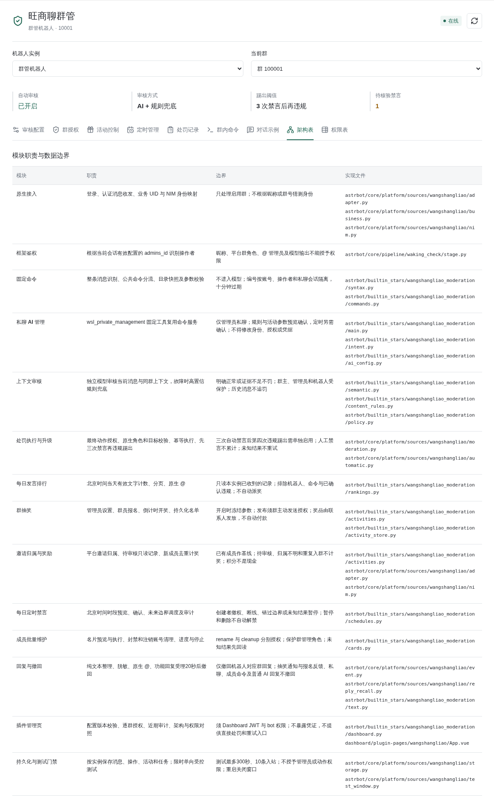

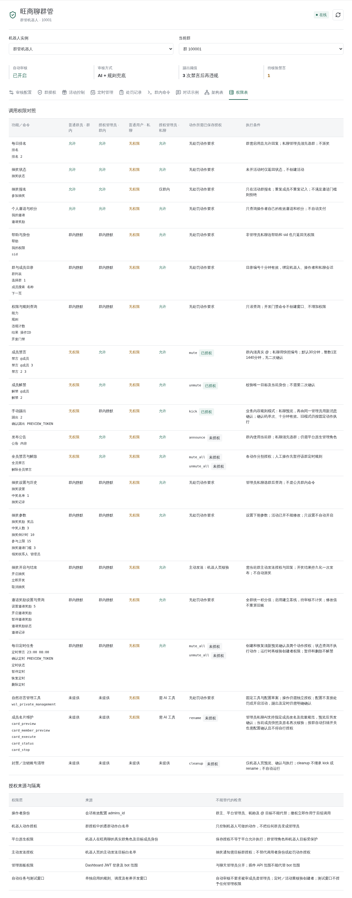

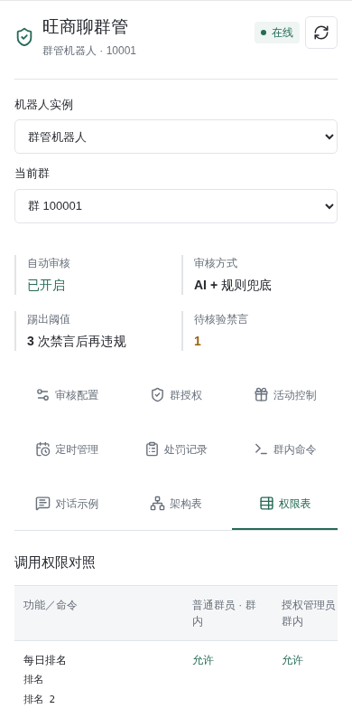

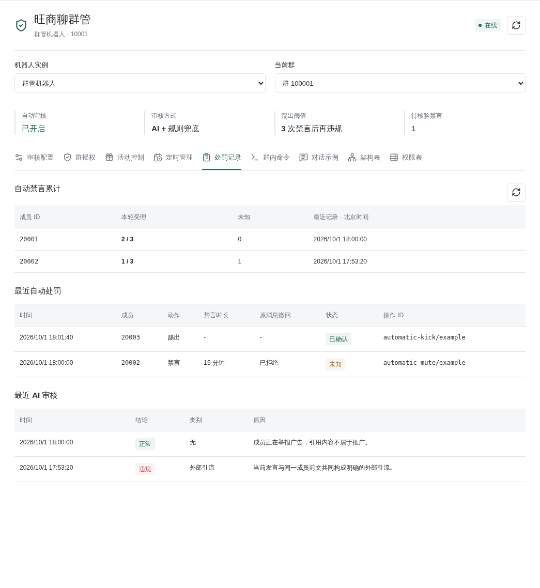

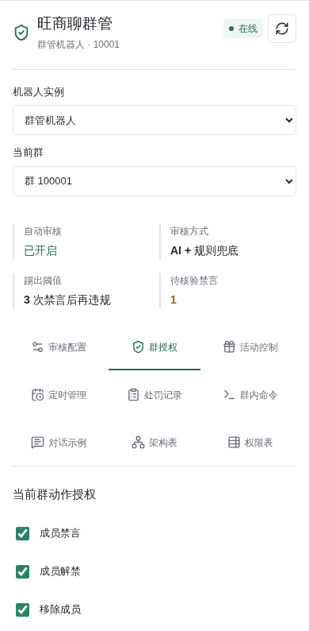

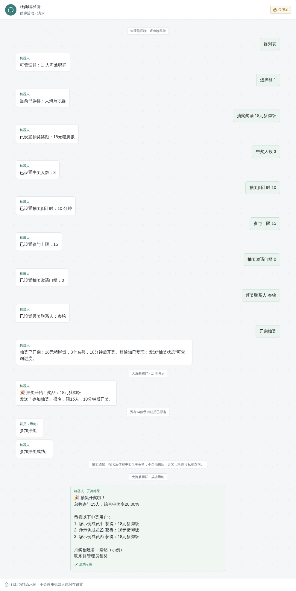

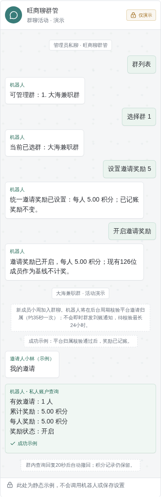

## 3. 选择群与回复方式

1. 点击「刷新群聊列表」，在「勾选启用群聊」选择需要接入的群；留空代表不处理群聊。
2. 查看群目录是否完整。目录不完整或成员映射不明确时，管理操作会拒绝，不能靠昵称猜人。
3. 按需设置私聊回复和各群回复开关。要使用群内排名和管理命令，必须开启该群回复；关闭时命令不回复、不执行。普通 AI 群聊回复仍需明确提及机器人；回复开关和群管理动作授权是不同设置。
4. 每次修改后点击「保存更改」，看到「配置已保存」才算完成。

## 4. 配置私信管理

1. 用你自己平时使用的旺商聊账号打开机器人的私聊，不要在群里操作，也不要用另一机器人账号测试。
2. 首次主管请让维护人员从已有会话记录核实旺商聊 UID，不要把昵称、手机号或群号当作 UID。普通用户私聊 `sid`、帮助和其他命令均只返回“无权限”；已配置管理员才可使用 `sid`。
3. 回到 WebUI「配置文件」，打开实际路由到该实例/会话的配置。找到「管理员 ID」
   或搜索 `admins_id`，点击「从对话选择」，按昵称搜索已有私聊，勾选并保存。
   名称和平台用于展示，账号区分同名，底层仍以准确 UID 授权。
   未关联对话的旧管理员保留，仍可移除或手动添加。无记录时先发送普通咨询；
   群聊和群聊创建者不作为管理员候选，不能通过聊天自授权。
4. 确认机器人仍路由到这个配置文件，且启用了旺商聊群管内置插件。管理员权限是 AstrBot 权限，不只包含本群；只授予可信账号。
5. 回到机器人私聊发送 `我的权限`，确认显示 AstrBot 管理员「是」，再发送 `帮助`。

现在直接发送命令，不需要斜杠、`群管` 前缀或 @ 机器人。命令只按整条消息匹配，
不会把「这个排名不错」「不要全员禁言」识别成命令。旧 `/群管` 写法仍兼容，
权限始终检查当前有效配置的管理员 ID，而不是昵称、群名片或文字自称管理员。
群内 `排名` 对普通群员开放，管理命令只允许上述管理员 UID 执行；@ 的目标身份
不会变成操作者权限。机器人的「主动发送授权」控制机器人主动向哪些会话发送消息，
不是成员管理员名单，不能替代 `admins_id`。
若固定命令可用但自然语言不处理，请检查私聊回复开关、模型和工具设置；固定命令不调用模型。

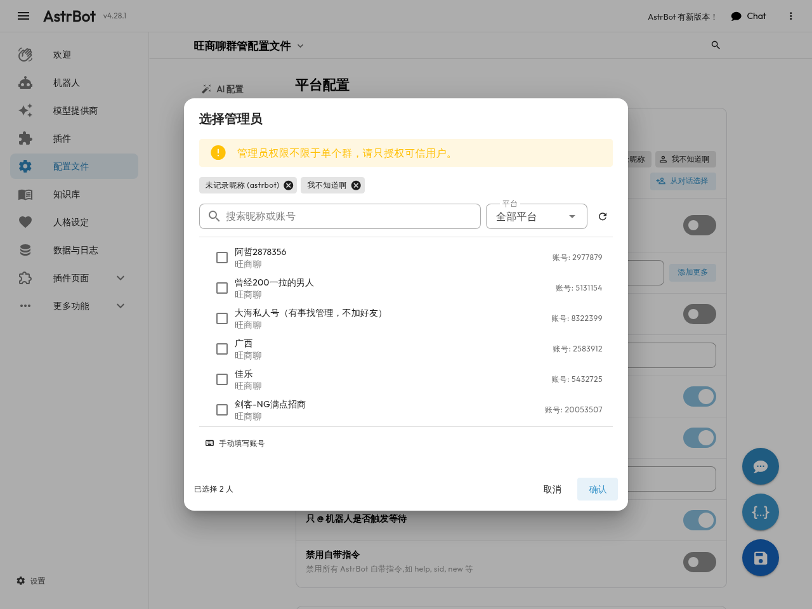

### 群内今日排行

普通群员在已启用且允许回复的群里直接发送 `排名` 或 `今日排名`，无需 @ 机器人。
返回「今日发言排行」「第 1 页 / 每页 20 条」和编号榜单，群内真实 @ 有有效身份映射的
榜单成员，不再 @ 查询者或附带日期、自己的名次和统计说明。发送 `排名 2` 查第二页；
`排行`、`今日排行` 也是别名。统计仍按北京时间当天，只读取机器人实际收到并验证的文字，
不声称包含离线时未收到的聊天。映射缺失时只显示名字，不伪造 @；无数据只显示「暂无记录」。

群内上述功能回复在平台受理后20秒自动撤回，包括排名、管理命令结果、无权限、
自动违规警告。私聊专用命令在群内静默，不再发送转私聊提示。只撤回机器人自己的消息，成员命令、私聊、
普通 AI 聊天和主动发送内容不受影响。重启和短暂断线不会丢失待撤回任务；
过期五分钟的任务不补执行，未知撤回结果不重复提交。
私聊查榜需要管理员先选择群，使用普通文字而不是群成员 @。
每人30秒内最多计一次，相同内容五分钟内不重复计数；机器人、命令、纯表情和已确认违规
消息不计。并列先按达到当前计数的时间排序，再按稳定 UID 排序；榜单缓存十秒。
目前是只读查询，不自动公布昨日榜、不设奖、不派奖。图片、语音和无法核实时间的消息不计。
群回复关闭时不响应裸命令，自动违规审核与处罚仍按原独立授权处理。

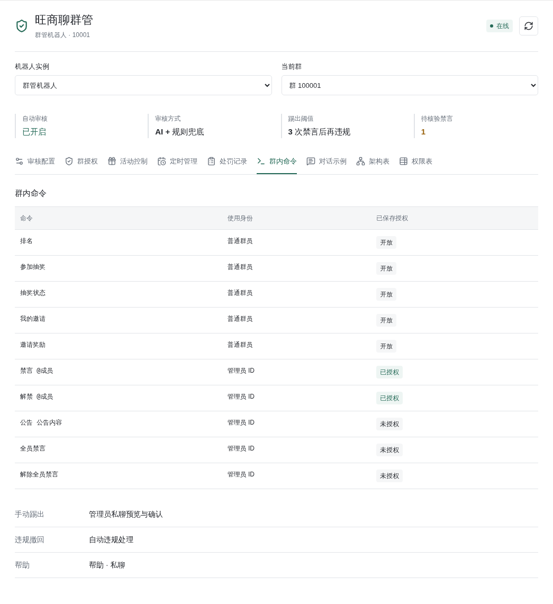

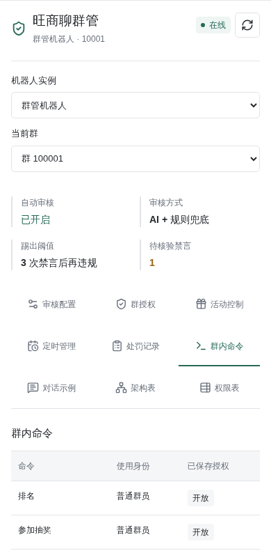

## 5. 授予每个群的动作权限

### 群抽奖和邀请奖励

管理员私聊先发送 `群列表`，按群名确认后发送 `选择群 1`。编号只对当前操作者有效，
十分钟后过期；同名群会附群号区分。每条命令必须单独发送，不要把多条命令粘贴成一条消息。
示例抽奖：

```text
抽奖奖励 18元猪脚饭
中奖人数 3
抽奖倒计时 10
参与上限 15
抽奖邀请门槛 0
领奖联系人 秦铭
开启抽奖
```

开启前为该群保存主动发送授权和群回复；不会由聊天命令增加发送权限。倒计时按分钟，
上限 `0` 为不限，邀请门槛按本群已记账的有效邀请数计算。默认门槛0、上限15、
中奖3人、倒计时10分钟；奖品和联系人必须明确设置。开启后本期参数不再修改。
群员发送 `参加抽奖`，重复只记一次；`抽奖状态` 可查询状态。到期后核验成员仍在群内，
随机抽取配置人数，统一真实 @ 中奖名单并显示中奖率。15人参与、3人中奖为20.00%。
报名未满仍按到期时间开奖，人数不足时最多抽取实际合格人数，不编造中奖用户。
管理员会收到包含奖品、名额和开奖时间的开启回执；群内通知受理后才开放报名。

管理员私聊可用 `立即开奖`、`取消抽奖`、`中奖名单`、`中奖名单 1`、`抽奖记录`。
历史期数可由记录查询。抽奖通知、报名和状态回复不自动撤回，结果记录仍可私聊查看；
开奖通知未知不重新抽取、不盲目补发。奖品由联系人发放，机器人不自动付款。

邀请奖励逐条发送：

```text
设置邀请奖励 5
开启邀请奖励
邀请奖励状态
邀请记录
暂停邀请奖励
```

同群统一数值，最多两位小数，作为积分记账。启用时现有成员建立基线，不补历史；
之后约35秒检查一次，已入群、状态正常、双方仍在群内且平台明确返回邀请归属，
才计一次奖励。待审核、机器人、归属不明、重复进群和身份变化不计奖；无法核验的
新成员最多待核验24小时。修改数值只影响后续新奖励，不重算旧账；暂停再开启会对
现有成员重新建立基线，不补暂停期间的邀请。群员发送 `我的邀请` 或 `邀请奖励`
查看自己的累计。记账在后台核验后完成，不会逐笔主动群发到账提醒；状态异常可由管理员
私聊 `邀请奖励状态` 查看。系统不自动支付现金，也不估算离线缺口中的进群。

在机器人页面群管权限区域选择一个已启用群，勾选允许动作，再保存。违规自动化需要撤回和禁言权限；人工恢复需要解禁；人工踢出需要踢出权限。不要为了方便勾选所有其他动作。

每群单独保存必要授权，新群不会自动继承。机器人仍须有真实群管理角色；
不能按截图或以前部署的授权状态推定当前群已授权。

活动范围：中奖人数1至100、倒计时1至10080分钟、容量0至10000（0不限）、
邀请门槛0至10000人、奖励0至999999.99积分（最多两位小数）。
有限容量时中奖人数不能大于容量。“拉3人才能参加”设置 `抽奖邀请门槛 3`，
群员仍需发 `参加抽奖`，不是自动报名。15名有效参与者、3个赢家才是20.00%。

### 谁邀请了谁与待审核

奖励使用 NIM 当前成员邀请归属核对业务身份，不分析聊天自称。
邀请查询还可只读获取业务申请日志，显示申请人、邀请者、原始状态/时间；
仅覆盖账号可见记录，空列表不证明全群无待审核。待审核可查关系，
未成功入群不计人数/奖励。详见[插件说明](../../../astrbot/builtin_stars/wangshangliao_moderation/README.md)。

## 6. 私聊命令：先选群，再选成员

按顺序在机器人私聊发送，每行是一条独立消息：

```text
群列表
选择群 1
成员列表
```

这里的 `1` 是刚收到列表中的序号，不是固定群号。需要找人时使用：

```text
成员搜索 小明
下一页
```

核对成员名片和业务 ID，再使用当前页成员编号。选群和成员编号十分钟有效；切群、换页、换账号后重新核对，过期就重新查询。

```text
禁言 2
禁言 2 3
解禁 2
```

`2` 仅为示例，请替换成核对后的成员编号。手动禁言不填时长默认30分钟；
`禁言 2 3` 禁言3分钟。群内使用客户端成员选择器真实 @，发送 `禁言 @成员 3`，
也支持 `禁言@成员 3`；`禁言 @成员` 默认30分钟。时长须为1至1440的整数分钟。
单发 `禁言` 仍需指定目标，不会猜测要禁言谁。禁言、解禁无须二次确认，平台受理后
直接返回「禁言已受理：3 分钟」或「解禁已受理」；未知请求仍不能盲目重试。
自动违规处罚和维护命令的原有一分钟默认不变。

## 7. 踢出必须在私聊二次确认

1. 完成选群、搜索成员并核对身份。
2. 发送 `踢出 2`。机器人只返回预览，包含群、成员和确认码，此时尚未踢出。
3. 再次核对目标。只有确实要执行时，原管理员在同一私聊发一条新消息：

```text
确认踢出 <机器人返回的确认码>
```

替换整个占位符，不保留尖括号。确认码十分钟有效、只能使用一次，其他管理员不能代用，群里回复“确认”无效。若不想执行，不发送确认即可；过期后需要重新预览。

执行时再次检查权限与成员身份，群主和管理员不可作为踢出目标。当前接收机器人启用 `manual_kick_only`：AI与自动规则不踢人，也不能通过自然语言重新开启自动踢出；只有上述人工私聊固定命令及独立确认可执行。机器人不会主动群发私聊催确认。

## 8. 自动违规规则怎么工作

| 情况 | 当前处理 |
|---|---|
| 真实群主、管理员发布 | 豁免自动处罚 |
| 明确联系方式/外链与引流、返利营销组合 | 首次撤回后警告；24 小时内已有受理警告后再犯禁言 |
| 成人露骨内容与推广、群号等组合 | 同样进入高置信违规规则 |
| 普通数字、单独链接、明显举报引用 | 不据此自动处罚 |
| 规则生效前、时间未知或超过五分钟的消息 | 只审计，不追罚 |
| 踢出 | 当前接收机器人仅允许人工私聊固定命令预览并另发确认；AI与自动规则不踢人 |

当前识别文本，不识别图片二维码、语音内容，也不能保证识别所有变体。管理员转发过的域名不会永久成为白名单；普通成员转发仍按规则检查。

### AI 上下文审核与递进禁言

在机器人群管授权区打开“自动违规处理”和“AI 上下文语义审核”，选择审核模型并保存。模型直接通过 AstrBot 已配置的真实提供商调用，不使用聊天人格、工具执行或跨群历史。默认读取同群十分钟内最多二十条先前消息，审核当前发言及同一成员前后文；审核不要求 @ 机器人。

AI 明确正常或证据不足时不处罚，不再让关键词覆盖该判断。模型超时、不可用、返回格式错误或证据不对应当前消息时，退回原有高置信文本规则。群友发言、昵称和引用始终是待审数据，不能授予权限或改写审核规则。开启后，所选模型服务会收到这些文本上下文。

开启“递进禁言＋撤回”，并保存目标群的 `mute`、`recall` 授权。当前接收机器人前三次分别撤回并禁言5、15、60分钟，第四次及之后仍撤回并禁言最多60分钟，不踢出；无需为此授予 `kick`。该递进开关为机器人实例级，不是按群独立的时长配置。次数按机器人账号、群、成员持久保存，不因重启或模型切换归零；人工禁言和旧历史不补算。撤回与禁言各自记录结果，不能把任一请求受理说成两项都成功。

未开启递进模式的兼容路径仍先撤回警告、二十四小时内再犯禁言。只有其他未开启 `manual_kick_only`、另行明确授权的实例才保留第四次违规踢出分支；这不是当前机器人的设置，也不是本教程要求开启的功能。

重复消息和重复操作不重复计数，拒绝、失败、未知不计数。未知禁言或踢出停止该成员后续自动处罚并保留核验记录，不能靠发新消息重复处罚。兼容自动移出流程须回读完整成员目录，确认移出才结束本轮计数；重新进群按新一轮处理。平台受理仍不等于确认。

任何开关都不能绕过群启用、机器人真实群管理角色或目标保护；群主、管理员及已接入机器人仍不被自动处罚。新增群不会自动获得动作授权。解禁继续通过原有管理员命令或私聊 AI 工具执行，不因普通成员一句道歉自动解除，也不覆盖人工处罚。

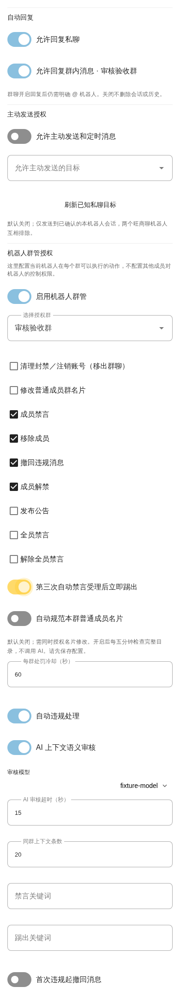

截图用于定位审核设置；旧版本图中的自动踢出选项不代表当前已开启，应以实时保存配置为准。

在私聊选群后查询：

```text
规则
能力
违规计数
结果 <操作ID>
```

结果 `accepted` 表示上游受理，不等于已核实完成；`verified` 表示已确认；`unknown` 表示结果未知，先查结果，不反复提交处罚。审计里的历史/身份待核查状态不代表成员已被处罚。

## 9. 每日全员禁言与解禁

新计划不会默认启用。先查当前计划，再为目标群授权「全员禁言」和
「解除全员禁言」（`mute_all`、`unmute_all`），机器人须有真实群管理角色。

主管在私聊选群后逐条发送：

```text
定时禁言 23:00 08:00
确认定时 <预览中的确认码>
定时状态
```

每群一条每日北京时间规则，支持跨午夜；严格 `HH:MM`，时刻不相等。
预览包含目标群与下次动作；确认码绑定账号、管理员、私聊及版本，
十分钟有效、一次使用、必须新消息确认。自然语言可提出时段修改，
但 `确认设置 <码>` 后仅生成定时预览，另发 `确认定时 <新码>` 才生效。

保存和恢复均只从下一个未来边界执行，不立即调整当前群状态。例如凌晨保存上述规则，下次动作为 08:00 解禁；请先核对预览是否符合你的意图。

| 命令 | 效果 |
|---|---|
| `暂停定时` | 停止未来调度，不改变当前禁言状态 |
| `恢复定时` | 重新预览，必须私聊确认后才恢复 |
| `删除定时` | 删除未来计划，保留审计，不自动解禁 |
| `定时状态` | 查询时段、启停、下次计划、最近回执及故障原因 |

通过机器人手动全员禁言或解除，会先暂停该群定时计划。其他管理员从旺商聊客户端直接改状态，机器人不能保证识别其意图；临时接管前请先暂停计划。停止操作无法撤回已经提交上游的请求。

离线、创建者失去 AstrBot 管理权限、群停用、动作授权撤销、换账号、错过边界或未知回执都会暂停规则。重启不补发错过的动作；核查实际状态及故障原因后，再预览并确认恢复。`accepted` 仅表示受理，`unknown` 需核查，不要重复提交。规则与审计持久保存，卸载插件会停止调度而不删除审计。

## 10. 人格、知识库与自然语言管理

群内 @ 使用该群人格和知识库；普通私聊使用私聊配置。知识内容须审核维护，
不是实时活动状态，不自动学习每条消息，不应存放密码。插件页可逐群选择客服模型；
留空沿用原群会话模型，不替换人格/知识库。

知识库不能授予管理权限。自然语言群管理还需要支持工具调用的模型，并让当前人格可以使用 `wsl_private_management`；该工具只向通过鉴权的管理员私聊开放。若模型、工具或人格尚未配置好，使用上述确定性命令即可。

插件页可独立选实例管理员群管模型与审核模型。管理员群内 @ 仍是客服；
普通用户私聊固定命令（含“我的权限”“我的邀请”）返回“无权限”，咨询“你是谁”
才进入客服。审核无需 @，不继承客服人格/知识库，无工具。

自然语言示例：私聊“把大海兼职群下期抽奖设置为3人中奖、10分钟、上限15人”。
核对目标与前后值，再新消息发 `确认设置 <码>`；仅保存参数，仍须 `开启抽奖`。
草案十分钟有效，不可换人/私聊确认，配置变化须重新预览。
除逐群自动踢出开关外，审核开关/关键词等仍为实例级，可能影响其他群。
不能让 AI 添加管理员、改授权/凭据。完整字段见插件参考。

新写的群友型 `SOUL.md` 与已导入知识库是两件事；只有在配置文件选择相应人格后才生效，不要把存在一个文件当作已切换人格。

## 11. 常见问题

| 现象 | 检查顺序 |
|---|---|
| WebUI 登录错误 | 确认是后台账号，而不是旺商聊账号；手动输入，避免浏览器填旧密码 |
| SSH 换端口后要求重新登录 | 不同 localhost 端口登录存储不同，使用固定隧道端口 |
| 私聊提示无权限 | 请维护人员核实 UID 是否加入当前有效配置，而不是只加在其他配置；普通聊天仍按原设置处理 |
| 提示目标群未选择 | 重新执行群列表、选择群，再查成员 |
| 无法禁言、撤回或踢出 | 群已启用、动作已授权、机器人实际群角色、成员目录完整性逐项核对 |
| 看见违规但未处罚 | 管理员豁免、历史时间、低置信文本、机器人权限或未知回执均可能导致不处罚 |
| 确认码失效 | 是否超时、已使用、换账号/私聊、同一条消息重复执行；不要猜码 |
| 新规则保存后不生效 | 检查自动规则开关与保存状态；旧关键词字段不代表业务识别规则已修改 |
| 私聊全部无回复 | 检查正确接收实例、回复已保存、机器人互斥；保存测试范围还须开启测试 |
| 活动/定时未找到路由 | 核对运行后端、插件与页面同版、插件启用；不能靠反复保存解决 |
| 模型发出 thought/think 标签 | 更新出站过滤并重启核心；不是全量推理过滤，历史/日志不自动清理 |
| 排名多行挤成一行或 @ 前少空格 | 当前已知输出分段格式回归，见测试文档；不是管理员/客服模型设置问题 |

## 12. 日常检查清单

- 看机器人在线状态及目录完整性。
- 修改群、权限和回复开关后保存。
- 用私聊「我的权限」「能力」「规则」核验配置，不用真实成员做处罚测试。
- 处理异常前查操作结果；未知结果不盲目重试。
- 群公告、直播入口或规则更新后由管理员审核再更新知识库。

本文不包含账号密码、密钥、真实联系人或私人消息，可下载给授权维护人员阅读。菜单名称可能随 AstrBot 版本略有差异，实际能力以当前界面与权限校验为准。
